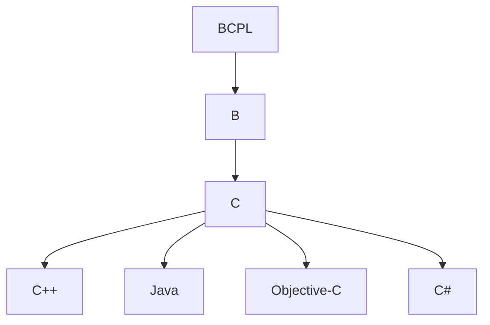

# Séance 1 : Introduction au Langage C et Environnement de Développement (3 heures)

## Partie 1 : Historique et Importance du C

### 1. Brève histoire du langage C (Bell Labs, Unix)

Le langage C est un pilier incontournable de la programmation moderne, qui trouve son origine dans les laboratoires Bell Labs au début des années 1970. Il a été créé par Dennis Ritchie entre 1972 et 1973, dans le but initial de faciliter le développement du système d'exploitation Unix.

#### Contexte historique

Avant le C, beaucoup de systèmes étaient programmés en langage assembleur, très lié au matériel et difficile à maintenir. À Bell Labs, après l'arrêt du projet Multics, Ken Thompson avait commencé à écrire Unix en assembleur pour un PDP-7, puis pour un PDP-11. Cela limitait la portabilité du système.

Dennis Ritchie a donc conçu le C comme une évolution d'un langage précédent nommé B, en y ajoutant notamment la notion de structures (struct), ce qui n’existait pas dans B ni dans d'autres langages comme BCPL. Cette innovation permettait une meilleure manipulation des données complexes, ce qui était fondamental pour un système d'exploitation.

Le passage d'assembleur à un langage de haut niveau comme C a permis à Unix de devenir le premier système d'exploitation écrit majoritairement en C, ce qui a grandement facilité sa portabilité sur différents types de machines.

#### Impact et diffusion

À partir de 1975, Unix et le langage C ont commencé à être licenciés à l'extérieur de Bell Labs, ce qui a fortement contribué à leur diffusion dans le monde universitaire et industriel. C a influencé de nombreux langages modernes (C++, C#, Java) et reste encore aujourd'hui utilisé pour la programmation système, l'embarqué, et bien d'autres domaines.

---

### Exemple simple en C : Programme "Hello, World!"

```c
#include <stdio.h>

int main() {
    printf("Hello, World!\n");
    return 0;
}
```

Ce programme illustre la simplicité et la puissance du langage C. Il affiche le message "Hello, World!" à l'écran, utilisant la bibliothèque standard `stdio.h`.

---

### Diagramme Mermaid : Évolution du langage C



Ce diagramme montre comment le langage C est issu de B (lui-même dérivé de BCPL) et a donné naissance à plusieurs langages modernes.

---

### Références

- Wikipedia - [C (programming language)](https://en.wikipedia.org/wiki/C_(programming_language))
- GeeksforGeeks - [History and Applications of C](https://www.geeksforgeeks.org/c/history-and-application-of-c/)
- Medium - [Dennis Ritchie: A journey through C and Unix](https://medium.com/fosscomics/10-dennis-ritchie-a-journey-through-c-and-unix-b438512abd9b)
- Ars Technica - [The origins of C](https://arstechnica.com/features/2020/12/a-damn-stupid-thing-to-do-the-origins-of-c/)

---

Ce résumé historique met en lumière la genèse du langage C et son lien étroit avec le développement du système Unix, expliquant ainsi sa robustesse, sa portabilité et son importance continue dans le monde informatique.