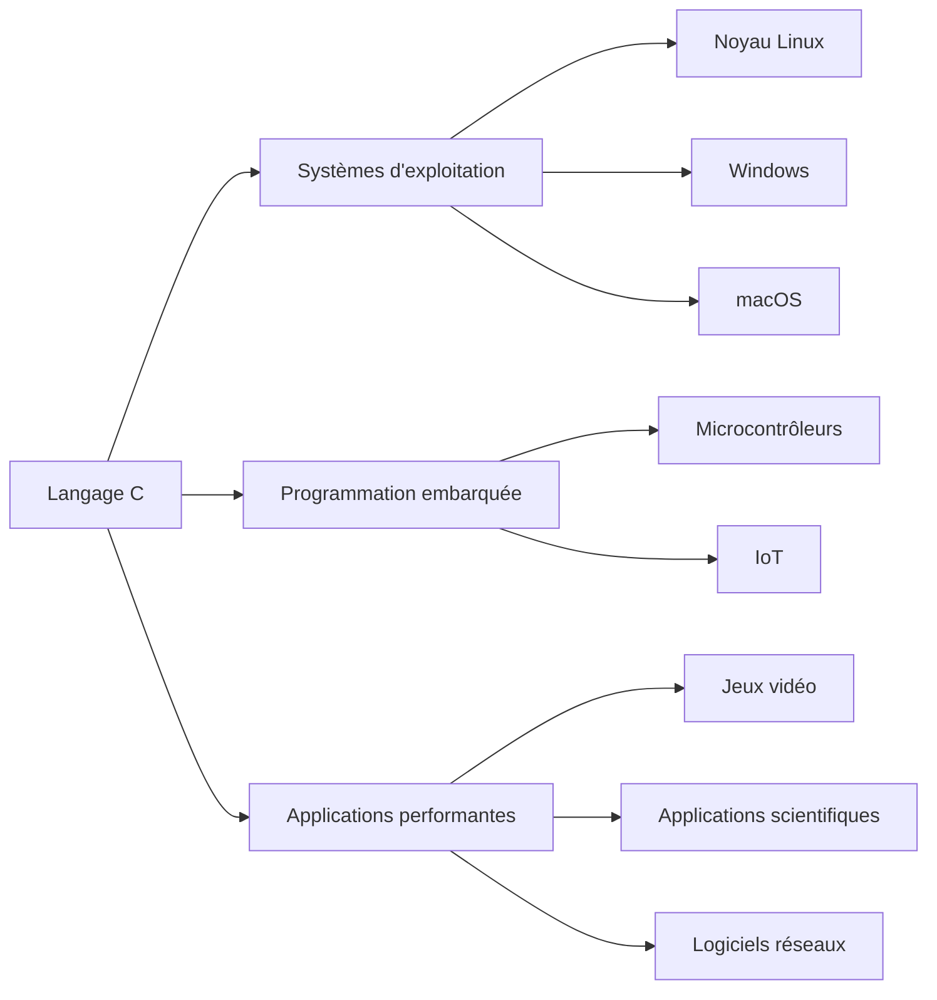

# Séance 1 : Introduction au Langage C et Environnement de Développement (3 heures)

## Partie 1 : Historique et Importance du C

### 2. Pourquoi le C est-il encore pertinent aujourd'hui ?  
*(Systèmes d'exploitation, embarqué, performance)*

---

### Le langage C : une pertinence toujours d’actualité

Bien que ce langage ait été inventé dans les années 1970, le C continue d’être massivement utilisé dans des domaines où la maîtrise fine des ressources matérielles et la performance sont essentielles.

---

### 1. Systèmes d'exploitation et logiciels systèmes

Le noyau des principaux systèmes d’exploitation (Linux, Windows, macOS) est majoritairement écrit en C. Cela s’explique par plusieurs facteurs :

- **Contrôle sur la mémoire** : le C offre un accès direct à la mémoire via les pointeurs, essentiel pour gérer les ressources système critiques.
- **Portabilité** : le C permet d’adapter facilement un système à différentes architectures matérielles sans repartir de zéro.
- **Performance** : les programmes en C sont compilés en code machine efficace, vital pour la réactivité et la stabilité.

> **Exemple : Le noyau Linux**

Le noyau Linux est écrit à plus de 90% en C, avec un peu d’assembleur pour les parties les plus sensibles au matériel. Cette base en C permet une évolutivité et une maintenance robuste.

---

### 2. Programmation embarquée (microcontrôleurs / IoT)

Dans les systèmes embarqués, qui fonctionnent souvent avec des ressources (mémoire, CPU) limitées, il est primordial d’avoir un langage qui :

- permette un **contrôle fin des ressources**,
- génère du code extrêmement **léger et rapide**,
- s’exécute proche du matériel.

Le C est donc le sujet de prédilection pour les microcontrôleurs, les systèmes temps réel, les dispositifs IoT.

> **Exemple : Arduino**

La plateforme Arduino utilise le C/C++ pour programmer des microcontrôleurs. Ce choix répond à la nécessité d’un code très performant avec un contrôle rigoureux du matériel.

---

### 3. Performance et efficacité

Le C, étant un langage **compilé**, produit du code machine natif qui s’exécute rapidement. Contrairement aux langages interprétés ou gérés comme Python ou JavaScript, le C :

- évite la surcharge d’un interpréteur ou machine virtuelle,
- permet des optimisations poussées par le compilateur,
- donne la possibilité d’écrire des routines très performantes pour des calculs lourds ou du traitement bas niveau.

---

### Diagramme Mermaid : Domaines d'utilisation du langage C



---

### Exemples illustratifs

1. **Allocation manuelle de mémoire**  
Le C offre `malloc`/`free` pour un contrôle explicite de la mémoire, crucial dans les systèmes embarqués.

```c
#include <stdlib.h>
#include <stdio.h>

int main() {
    int *arr = malloc(5 * sizeof(int));
    if (arr == NULL) {
        printf("Allocation échouée\n");
        return 1;
    }
    for (int i = 0; i < 5; i++) {
        arr[i] = i * 2;
        printf("%d ", arr[i]);
    }
    free(arr);
    return 0;
}
```

2. **Gestion directe des bits**  
En programmation bas niveau, le C permet d’utiliser des opérations bit à bit rapides.

```c
unsigned char flags = 0b00001100;
// Activer le 1er bit
flags |= 0b00000001;
// Désactiver le 3e bit
flags &= ~(0b00000100);
```

---

### Sources utilisées

- GNU Project - [Why use C?](https://www.gnu.org/software/libc/manual/html_node/Why-Use-C.html)  
- Embedded.com - [Why is C still the best language for embedded systems?](https://www.embedded.com/why-is-c-still-the-best-language-for-embedded-systems/)  
- Linux Kernel Archives - [About the Linux Kernel](https://www.kernel.org/doc/html/latest/process/about.html)  
- Arduino - [Arduino and C/C++](https://www.arduino.cc/en/Reference/HomePage)  
- Stack Overflow Insights - [Programming Language Trends 2023](https://insights.stackoverflow.com/survey/2023#technology-most-popular-technologies)

---

Ce panorama illustre que le langage C reste un choix privilégié, notamment dans les domaines critiques, où la maîtrise du matériel et la performance sont déterminantes. Sa simplicité, son efficacité et sa souplesse en font un outil irremplaçable.