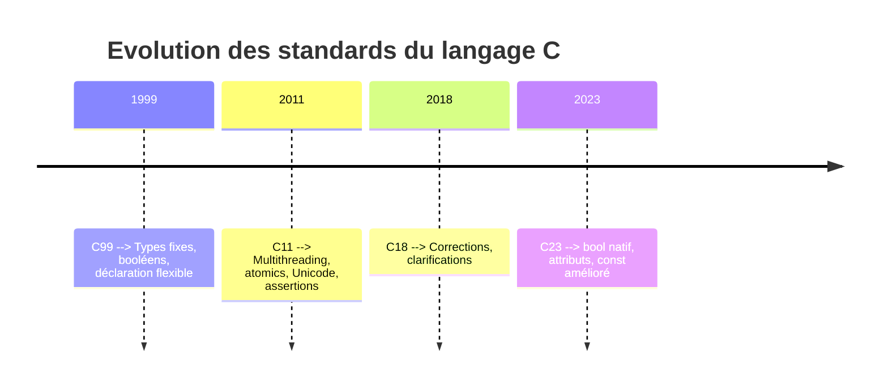

# Séance 1 : Introduction au Langage C et Environnement de Développement (3 heures)

## Partie 1 : Historique et Importance du C

### 3. Les versions du standard C : C99, C11, C18 et C23  
*(Focus sur les nouveautés clés, notamment en C23 comme `bool` et `const`)*

---

Le langage C est normalisé par l’ISO, permettant une évolution progressive pour répondre aux besoins modernes tout en restant fidèle à sa simplicité et sa performance. Quatre versions majeures du standard ont marqué son histoire récente :

| Version | Année | Nouveautés principales |
|---------|--------|-----------------------|
| C99     | 1999   | Types entiers fixes (`int32_t`), déclaration au milieu du code, support du booléen (`<stdbool.h>`), améliorations des macros, initialisation compound literals |
| C11     | 2011   | Multithreading (`_Thread_local`, atomics), améliorations de la sécurité (`static_assert`), fonctions anonymes, standardisation Unicode (UTF-16, UTF-32) |
| C18     | 2018   | Correction de bugs et de clarifications, pas de nouvelle fonctionnalité majeure |
| **C23** | 2023   | Nouveaux mots-clés, renforcement du type booléen natif, amélioration de `const`, attributs pour optimisation, support amélioré des littéraux |

---

### Zoom sur C23 : Les nouveautés clés

La dernière version C23 apporte des ajouts qui modernisent le langage tout en gardant sa compatibilité.

#### 1. Type booléen natif amélioré

Le langage intégre désormais un type booléen natif sans nécessiter d’inclure `<stdbool.h>`. Ce type `bool` est un alias natif et fait partie du langage, ce qui simplifie l’écriture.

```c
bool a = true;
bool b = false;
```

#### 2. Amélioration de `const`

En C23, la gestion de `const` est renforcée afin de mieux exprimer les intentions sur la mutabilité des données, notamment avec de nouveaux attributs permettant d’accroître la sécurité et de faciliter les optimisations du compilateur.

Exemple simple :

```c
const int x = 10;  // x ne peut pas être modifié
```

Avec les nouveaux attributs, on peut désormais marquer plus finement les variables et les fonctions (exemple : `[[nodiscard]]` pour signaler à l’utilisateur qu’une valeur de retour ne doit pas être ignorée).

#### 3. Nouveaux mots-clés et attributs

C23 introduit des mots-clés réservés supplémentaires et des _attributs_ (annotations) qui permettent de guider le compilateur pour optimiser le code ou générer des alertes en cas d’usage incorrect.

---

### Exemple pratique : utilisation des booléens et `const` dans C23

```c
#include <stdio.h>

int main(void) {
    bool is_valid = true;  // booléen natif C23
    const int max_value = 100;

    if (is_valid) {
        printf("La valeur maximale est %d.\n", max_value);
    }

    return 0;
}
```

---

### Diagramme Mermaid : Chronologie des standards C et leurs apports clés



---

### Sources utilisées

- ISO C standards overview - [ISO/IEC JTC1/SC22/WG14 standard documents](https://www.open-std.org/jtc1/sc22/wg14/)
- GNU C Library - [C99 and C11 improvements](https://www.gnu.org/software/libc/manual/html_node/Standard-Extensions.html)
- WG14 Draft Proposal - [C2x New Features (C23)](https://www.open-std.org/jtc1/sc22/wg14/www/docs/n3094.pdf)
- ISO C23 summary - [https://dev.sololearn.com/Discussion/3133636/c23-language/](https://dev.sololearn.com/Discussion/3133636/c23-language/)
- CPP Reference - [C23 new features](https://en.cppreference.com/w/c/language/feature_test_macros)

---

En synthèse, les versions modernes du langage C enrichissent ses possibilités sans perdre la simplicité qui fait sa force, avec C23 affirmant les avancées vers un code plus sûr, clair et performant.