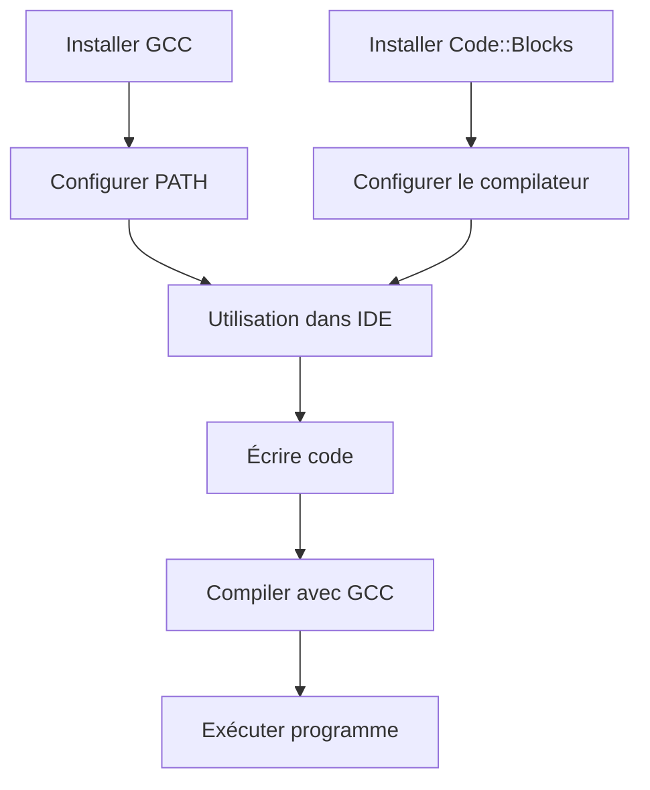

# Séance 1 : Introduction au Langage C et Environnement de Développement (3 heures)

## Partie 2 : Préparation de l'Environnement de Développement

### 2. Étapes d'installation de GCC et d'un IDE (exemple : Code::Blocks)

Installer un environnement de développement complet est une étape incontournable pour programmer en C. Cette partie détaille les procédures d’installation de GCC, le compilateur C incontournable, ainsi que de l’IDE Code::Blocks, populaire et adapté aux débutants.

---

## 1. Installation de GCC

### Sur Windows (via MinGW)

1. **Télécharger MinGW-w64**  
   Rendez-vous sur le site officiel : https://www.mingw-w64.org/  
   Alternativement, un installateur facile à utiliser est disponible ici : https://winlibs.com/

2. **Lancer l’installation**  
   - Choisissez la version recommandée (64-bit ou 32-bit selon votre système).
   - Sélectionnez l’architecture (« x86_64 » pour 64 bits).
   - Spécifiez un dossier d’installation, par exemple `C:\mingw-w64`.

3. **Ajouter MinGW au PATH**  
   Ajoutez le chemin vers le dossier `bin` de MinGW (ex : `C:\mingw-w64\bin`) à la variable d’environnement PATH (via Panneau de configuration > Système > Paramètres avancés > Variables d’environnement).  
   Cela permet d’utiliser `gcc` directement dans le terminal.

4. **Vérification**  
   Ouvrez une invite de commandes (cmd) et tapez :
   ```
   gcc --version
   ```  
   Vous devez voir la version de GCC installée.

---

### Sur Linux

- Ouvrez un terminal et lancez :
  ```bash
  sudo apt update
  sudo apt install build-essential
  ```  
- La commande `build-essential` installe GCC ainsi que les outils classiques de compilation.

- Vérifiez avec :
  ```bash
  gcc --version
  ```

---

### Sur macOS

- Installez les outils en ligne de commande Xcode :
  ```bash
  xcode-select --install
  ```
- GCC est disponible via ces outils (équivalent `clang`), sinon via Homebrew :
  ```bash
  brew install gcc
  ```

---

## 2. Installation de Code::Blocks

Code::Blocks est un IDE open-source qui facilite la gestion de projets C/C++ et intègre facilement GCC.

### Sur Windows

1. **Télécharger Code::Blocks**  
   Accéder au site officiel : http://www.codeblocks.org/downloads  
   Choisir le package complet avec MinGW intégré, par exemple :  
   `codeblocks-20.03mingw-setup.exe`

2. **Installation**  
   - Exécutez le fichier téléchargé.  
   - Suivez l’assistant d’installation en conservant les options par défaut.  
   - L’IDE sera installé avec une version intégrée de GCC (MinGW).

3. **Premier lancement et configuration**

   - Lancez Code::Blocks.
   - Dans `Settings > Compiler`, vérifiez que le compilateur GNU GCC est sélectionné.
   - Créez un nouveau projet C simple (File > New > Project > Console Application > C).  
   - Testez la compilation et l’exécution d’un programme sample.

---

### Sur Linux

- Installer via gestionnaire de paquets :
  ```bash
  sudo apt install codeblocks
  ```
- Code::Blocks détectera automatiquement GCC si installé.

---

### Sur macOS

- Télécharger le fichier `.dmg` officiel de Code::Blocks : http://www.codeblocks.org/downloads  
- Suivre les instructions pour effectuer l’installation.

---

## 3. Exemple : Compilation et exécution dans Code::Blocks

Une fois le projet créé et le code écrit, l’IDE propose deux boutons principaux :

- **Build**  (ou "Compiler") : transforme le code source en exécutable.
- **Run** : exécute l’exécutable généré.

Exemple simple de code à tester (fichier `main.c`) :

```c
#include <stdio.h>

int main() {
    printf("Hello, Code::Blocks and GCC!\n");
    return 0;
}
```

---

## Diagramme Mermaid : Flux d’installation et utilisation de GCC avec Code::Blocks



---

## Sources utilisées

- GCC official site - [https://gcc.gnu.org/install/](https://gcc.gnu.org/install/)  
- MinGW-w64 - [https://www.mingw-w64.org/](https://www.mingw-w64.org/)  
- Code::Blocks download - [http://www.codeblocks.org/downloads](http://www.codeblocks.org/downloads)  
- Ubuntu Documentation - [https://help.ubuntu.com/community/InstallingCompilers](https://help.ubuntu.com/community/InstallingCompilers)  
- Homebrew for macOS - [https://brew.sh/](https://brew.sh/)  

---

Cette méthode permet d’obtenir rapidement un environnement stable et complet pour programmer en C avec un éditeur puissant et un compilateur performant, prêt à compiler, exécuter et déboguer des applications.