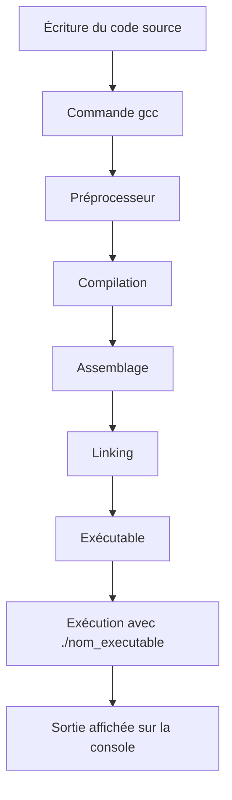

# Séance 1 : Introduction au Langage C et Environnement de Développement (3 heures)

## Partie 3 : Mon Premier Programme C

### 4. Compilation (`gcc nom_du_fichier.c -o nom_executable`) et exécution (`./nom_executable`)

---

La compilation et l’exécution sont deux étapes distinctes mais complémentaires dans le processus de développement d’un programme en C. Cette partie présente les commandes essentielles pour passer du code source au programme exécutable.

---

## 1. La compilation avec GCC

### Commande de base

```bash
gcc nom_du_fichier.c -o nom_executable
```

- **`gcc`** : le compilateur GNU pour le langage C.
- **`nom_du_fichier.c`** : fichier source contenant le code C.
- **`-o nom_executable`** : option pour spécifier le nom du fichier exécutable généré (par défaut `a.out` sous Linux/macOS).

### Exemple

Si votre code est dans un fichier `hello.c` :

```bash
gcc hello.c -o hello
```

Ce qui génère un exécutable `hello`.

---

## 2. Explication des étapes de compilation

- **Préprocesseur** : traite les directives `#include`, macros, etc.
- **Compilation** : traduction du code C en code assembleur.
- **Assemblage** : conversion en code machine objet.
- **Édition des liens (linking)** : assemble les objets, bibliothèques dynamiques ou statiques pour créer l’exécutable.

En une commande, `gcc` gère tous ces stades.

---

## 3. Exécution du programme

Sous Linux/macOS, ou dans un terminal compatible (ex: Git Bash sous Windows) :

```bash
./nom_executable
```

Exemple :

```bash
./hello
```

Affiche à l'écran le résultat du programme.

---

## 4. Remarques importantes

- Sous **Windows avec MinGW**, l’exécutable porte l’extension `.exe` automatiquement :

```bash
gcc hello.c -o hello.exe
hello.exe
```

- Si `-o` est omis, GCC crée un exécutable nommé par défaut `a.out`.

- Pour compiler en mode debug (avec symboles de débogage) :

```bash
gcc -g hello.c -o hello
```

---

## 5. Illustration avec un exemple concret

Code source `hello.c` :

```c
#include <stdio.h>

int main() {
    printf("Hello, Compilation and Execution!\n");
    return 0;
}
```

Compilation :

```bash
gcc hello.c -o hello
```

Exécution :

```bash
./hello
```

Sortie affichée :

```
Hello, Compilation and Execution!
```

---

## 6. Diagramme Mermaid : Processus global compilation et exécution



---

## 7. Sources utilisées

- GNU GCC Online Documentation - [https://gcc.gnu.org/onlinedocs/gcc-12.1.0/gcc/Invocation.html](https://gcc.gnu.org/onlinedocs/gcc-12.1.0/gcc/Invocation.html)  
- TutorialsPoint - [C - Compilation and Execution](https://www.tutorialspoint.com/cprogramming/c_program_structure.htm)  
- Linuxize - [How to Compile and Run C Program Using GCC Compiler](https://linuxize.com/post/how-to-compile-and-run-c-program-in-linux/)  
- Microsoft Docs - [Setting up GCC on Windows](https://docs.microsoft.com/en-us/cpp/build/walkthrough-compile-a-c-program-on-the-command-line)

---

La maîtrise des commandes GCC pour compiler et exécuter vos programmes C est indispensable pour développer efficacement sans dépendre uniquement d’un IDE. Le retour visuel direct permet d’affiner rapidement les corrections et améliorations sur votre code source.