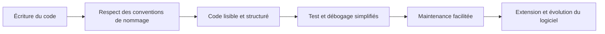

# Séance 1 : Introduction au Langage C et Environnement de Développement (3 heures)

## Partie 4 : Commentaires et Bonnes Pratiques

### 2. Conventions de nommage simples

---

Les conventions de nommage définissent des règles pour nommer variables, fonctions, constantes ou types dans un programme. Elles améliorent la lisibilité, facilitent la maintenance et évitent les erreurs. En langage C, bien que le standard ne les impose pas, l’adoption de conventions cohérentes est fortement recommandée.

---

## 1. Règles générales

- **Caractères autorisés** : lettres (a-z, A-Z), chiffres (0-9), et underscore `_`.
- **Premier caractère** : doit toujours être une lettre ou un underscore, pas un chiffre.
- **Respect de la casse** : en C, les noms sont sensibles à la casse (`Variable` et `variable` sont différents).
- **Pas d'espaces** ni de caractères spéciaux (`!`, `@`, etc.)

---

## 2. Conventions courantes

| Élément                  | Convention recommandée                         | Exemple                         |
|--------------------------|-----------------------------------------------|--------------------------------|
| Variables et fonctions    | minuscules, mots séparés par underscore (_)  | `nombre_utilisateurs`, `calcul_moyenne` |
| Constantes (macros)       | lettres majuscules avec underscores           | `MAX_TAILLE`, `NOMBRE_MAX`      |
| Types définis (`typedef`) | nom en PascalCase ou CamelCase (majuscule début de mot) | `Point2D`, `ListeChaînée`       |
| Variables locales         | nom court et descriptif                        | `i`, `compteur`, `temp`         |
| Variables globales        | préfixe `g_` ou suffixe `_global` pour indiquer leur portée | `g_total`, `config_global`      |

---

## 3. Exemples illustrés

```c
#include <stdio.h>

#define MAX_ITERATIONS 100       // Constante macro en majuscules

typedef struct Point {
    int x_coord;                // Variable membre en minuscules avec underscore
    int y_coord;
} Point2D;

int calcul_distance(Point2D p1, Point2D p2) {
    int delta_x = p2.x_coord - p1.x_coord;
    int delta_y = p2.y_coord - p1.y_coord;
    int distance = delta_x * delta_x + delta_y * delta_y;
    return distance;
}

int main() {
    Point2D pointA = {2, 3};
    Point2D pointB = {5, 7};
    
    int dist = calcul_distance(pointA, pointB);
    printf("Distance au carré: %d\n", dist);
    
    return 0;
}
```

---

## 4. Pourquoi adopter ces conventions ?

- **Lisibilité** : un code plus clair, intuitif pour les autres développeurs.
- **Maintenance facilitée** : repérer rapidement le rôle d’une variable ou fonction.
- **Prévention d’erreurs** : différencier facilement constantes, variables, types.
- **Cohérence dans une équipe** : travail collaboratif plus efficace.

---

## 5. Schéma Mermaid : Cycle de développement avec conventions de nommage



---

## 6. Sources utilisées

- GNU Coding Standards - [https://www.gnu.org/prep/standards/standards.html](https://www.gnu.org/prep/standards/standards.html)  
- Linux Kernel Coding Style (extraits) - [https://www.kernel.org/doc/html/latest/process/coding-style.html](https://www.kernel.org/doc/html/latest/process/coding-style.html)  
- Stack Overflow - [Conventions de nommage en C](https://stackoverflow.com/questions/20157644/coding-conventions-for-naming-variables)  
- Wikipedia - [Variable naming conventions](https://en.wikipedia.org/wiki/Naming_convention_(programming))  

---

L’application de conventions simples de nommage dès les premiers programmes en C contribue à la qualité globale du code et facilite la progressivité dans l’apprentissage et la pratique.