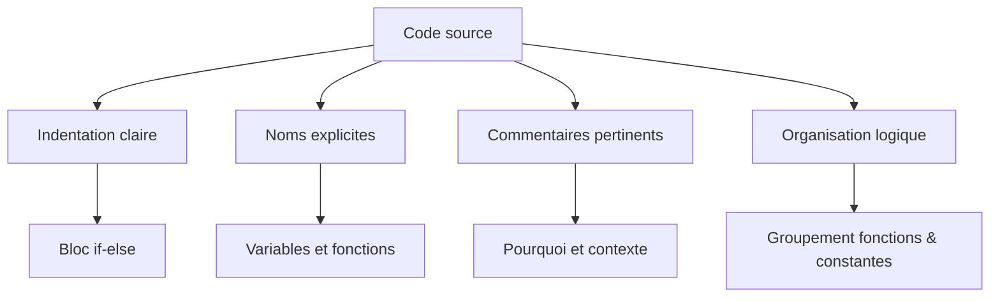

# Séance 1 : Introduction au Langage C et Environnement de Développement (3 heures)

## Partie 4 : Commentaires et Bonnes Pratiques

### 3. Lisibilité du code

---

La lisibilité du code désigne la facilité avec laquelle un programme peut être lu et compris par un développeur. En C, où la proximité avec la machine impose parfois une syntaxe compacte, adopter des qualités rédactionnelles claires est indispensable pour écrire un code maintenable.

---

## 1. Principes fondamentaux pour améliorer la lisibilité

- **Indentation régulière** : structurez visuellement les blocs de code.
- **Commentaires pertinents** : expliquez le "pourquoi", pas le "quoi".
- **Noms explicites** : variables et fonctions aux noms clairs et descriptifs.
- **Simplicité et concision** : évitez les constructions complexes inutiles.
- **Organisation logique** : regroupez les fonctions et les déclarations.
- **Utilisation des espaces** : séparez les opérateurs et les éléments pour aérer le texte.

---

## 2. Exemples illustratifs

### Mauvaise lisibilité

```c
int f(int a,int b){if(a>b){return a;}else{return b;}}
```

---

### Lisibilité améliorée

```c
int maximum(int a, int b) {
    if (a > b) {
        return a;
    } else {
        return b;
    }
}
```

---

### Commentaires et formatage

```c
// Renvoie la valeur maximale entre a et b
int maximum(int a, int b) {
    if (a > b) {
        return a;  // a est plus grand
    } else {
        return b;  // b est plus grand ou égal à a
    }
}
```

---

## 3. Outils et pratiques recommandés

- **Utilisation d’un linter** : détecte et corrige automatiquement le style (ex : `clang-format`).
- **Respect des conventions de style (`K&R`, `Allman`)** pour l’indentation et les accolades.
- **Séparation des responsabilités** dans les fonctions (une fonction = une tâche).

---

## 4. Diagramme Mermaid : Structure d’un code lisible



---

## 5. Impact sur la productivité et maintenance

Un code lisible permet :

- De réduire le temps de relecture et debugging.
- D’augmenter la collaboration entre développeurs.
- D’assurer une évolution plus sûre et rapide du logiciel.

---

## 6. Sources utilisées

- GNU Coding Standards - [https://www.gnu.org/prep/standards/standard.html#Formatting](https://www.gnu.org/prep/standards/standard.html#Formatting)  
- Clang-Format Documentation – [https://clang.llvm.org/docs/ClangFormat.html](https://clang.llvm.org/docs/ClangFormat.html)  
- Coding Horror - [https://blog.codinghorror.com/code-tells-you-how-comments-tell-you-why/](https://blog.codinghorror.com/code-tells-you-how-comments-tell-you-why/)  
- Stack Overflow - [How to write readable C code?](https://stackoverflow.com/questions/2448614/how-do-i-make-my-c-code-more-readable)  

---

Adopter des règles simples pour améliorer la lisibilité est un investissement durable : il facilite le travail individuel et collectif tout au long du cycle de développement logiciel.