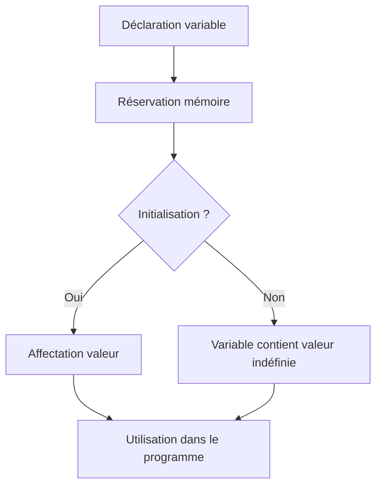

# Séance 2 : Les Fondamentaux du C (4 heures)

## Partie 1 : Variables et Types de Données

### 1. Qu'est-ce qu'une variable ? Déclaration, initialisation

---

## 1. Définition d’une variable

En langage C, une **variable** est une zone mémoire nommée utilisée pour stocker une donnée. Chaque variable a un **type** qui définit la nature de la donnée qu’elle peut contenir (nombre entier, caractère, nombre à virgule, etc.) ainsi que sa taille en mémoire.

---

## 2. Déclaration de variable

Déclarer une variable signifie informer le compilateur de son type et de son nom. La déclaration ne réserve pas forcément une valeur à la variable.

**Syntaxe :**

```c
type nom_variable;
```

### Exemples :

```c
int age;           // variable entière appelée age
float temperature; // variable décimale appelée temperature
char initiale;     // variable caractère appelée initiale
```

---

## 3. Initialisation de variable

L'initialisation consiste à assigner une valeur à la variable dès sa déclaration ou ultérieurement avant son utilisation.

**Initialisation lors de la déclaration :**

```c
int age = 25;
float pi = 3.14;
char lettre = 'A';
```

**Initialisation après déclaration :**

```c
int age;
age = 30;
```

---

## 4. Pourquoi initialiser ses variables ?

- Éviter les valeurs indéfinies (contenu mémoire aléatoire) qui peuvent provoquer des comportements imprévisibles à l’exécution.
- Faciliter la lecture et le suivi du programme.

---

## 5. Durée de vie et portée (scope) d'une variable (concept à approfondir)

- Les variables déclarées dans une fonction ont une portée locale.
- Les variables globales sont accessibles dans tout le programme.
- La durée de vie correspond au temps pendant lequel la variable reste accessible.

---

## 6. Exemple complet illustré

```c
#include <stdio.h>

int main() {
    int compteur = 0;            // déclaration et initialisation à zéro
    float moyenne;               // déclaration sans initialisation
    
    moyenne = 15.5;              // initialisation plus tard
    char grade = 'B';            // initialisation directe
    
    printf("Compteur: %d\n", compteur);
    printf("Moyenne: %.2f\n", moyenne);
    printf("Grade: %c\n", grade);
    
    return 0;
}
```

---

## 7. Diagramme Mermaid : cycle de vie d’une variable



---

## 8. Notes complémentaires

- Les noms de variables doivent respecter les règles de nommage (lettres, chiffres, underscore, premier caractère non-chiffre).
- En C, les variables non initialisées ont une valeur indéterminée.
- La bonne pratique est de toujours initialiser les variables avant utilisation.

---

## 9. Sources utilisées

- cppreference.com - [Variables in C](https://en.cppreference.com/w/c/language/variable)  
- TutorialsPoint - [C Variables](https://www.tutorialspoint.com/cprogramming/c_variables.htm)  
- ISO/IEC 9899:2018 – Langage C standard  
- GNU GCC documentation - [https://gcc.gnu.org/onlinedocs/gcc-12.1.0/gcc/Variable-Attributes.html](https://gcc.gnu.org/onlinedocs/gcc-12.1.0/gcc/Variable-Attributes.html)  

---

La déclaration et l’initiation des variables constituent le socle fondamental de la programmation en C. Les maîtriser permet de gérer efficacement les données manipulées dans vos applications.