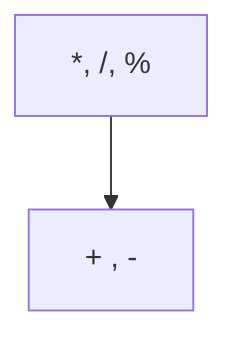

# Séance 2 : Les Fondamentaux du C (4 heures)

## Partie 2 : Opérateurs en C

### 1. Opérateurs arithmétiques : `+`, `-`, `*`, `/`, `%`

---

## 1. Présentation des opérateurs arithmétiques

Les opérateurs arithmétiques en langage C permettent d’effectuer des calculs mathématiques de base sur des variables numériques. Ils sont fondamentaux pour toute manipulation de données numériques.

| Opérateur | Description                    | Exemple               |
|-----------|-------------------------------|----------------------|
| `+`       | Addition                      | `a + b`              |
| `-`       | Soustraction                  | `a - b`              |
| `*`       | Multiplication                | `a * b`              |
| `/`       | Division entière ou flottante | `a / b`              |
| `%`       | Modulo (reste de la division) | `a % b` (entiers)    |

---

## 2. Comportement des opérateurs

- `+`, `-`, `*` s’appliquent aussi bien sur types entiers que flottants.
- `/` selon les types :
  - Si les opérandes sont entiers, la division est **entière**, la partie décimale est tronquée.
  - Si l’un des opérandes est flottant (`float` ou `double`), la division est flottante.
- `%` ne s’applique qu’aux entiers.

---

## 3. Exemples pratiques

```c
#include <stdio.h>

int main() {
    int a = 10, b = 3;
    float x = 10.0, y = 3.0;

    printf("Addition : %d + %d = %d\n", a, b, a + b);
    printf("Soustraction : %d - %d = %d\n", a, b, a - b);
    printf("Multiplication : %d * %d = %d\n", a, b, a * b);

    printf("Division entière : %d / %d = %d\n", a, b, a / b);
    printf("Modulo : %d %% %d = %d\n", a, b, a % b);

    printf("Division flottante : %.2f / %.2f = %.2f\n", x, y, x / y);

    return 0;
}
```

**Sortie :**

```
Addition : 10 + 3 = 13
Soustraction : 10 - 3 = 7
Multiplication : 10 * 3 = 30
Division entière : 10 / 3 = 3
Modulo : 10 % 3 = 1
Division flottante : 10.00 / 3.00 = 3.33
```

---

## 4. Particularités et erreurs courantes

- **Division par zéro** : cause d’erreur d’exécution, à éviter absolument.
- Le modulo n’existe pas pour les flottants (utiliser la fonction `fmod` de `<math.h>` pour cela).
- Dans les calculs entiers, l’opération peut provoquer un **overflow** (dépassement de capacité) non détecté par défaut.

---

## 5. Précédence des opérateurs

En C, les opérateurs arithmétiques ont un ordre de priorité :



- `*`, `/`, `%` sont évalués avant `+` et `-`.
- Les opérations du même niveau s'exécutent de gauche à droite.

---

## 6. Diagramme Mermaid : résumé des opérations

```mermaid
flowchart TD
    Start((Début))
    Start --> A[Lire opérandes a et b]
    A --> B{Type ?}
    B -->|Entier| C1[Effectuer +, -, *, / (division entière), %]
    B -->|Flottant| C2[Effectuer +, -, *, / (division flottante), pas de %]
    C1 --> D[Afficher résultats]
    C2 --> D
    D --> End((Fin))
```

---

## 7. Sources utilisées

- cppreference.com - [Arithmetic operators](https://en.cppreference.com/w/c/language/operator_arithmetic)  
- ISO/IEC 9899:2018 – Langage C standard (section 6.5 Expressions)  
- TutorialsPoint - [C Arithmetic Operators](https://www.tutorialspoint.com/cprogramming/c_operators.htm)  
- GNU GCC Documentation - [Expressions](https://gcc.gnu.org/onlinedocs/gcc/Expressions.html)  

---

Les opérateurs arithmétiques sont le socle des calculs en C. Savoir les utiliser avec attention sur les types et la gestion des erreurs est indispensable pour écrire un code efficace et correct.