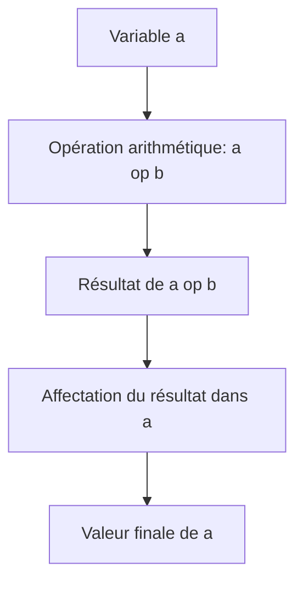

# Séance 2 : Les Fondamentaux du C (4 heures)

## Partie 2 : Opérateurs en C

### 2. Opérateurs d'affectation : `=`, `+=`, `-=`, `*=`, `/=`, `%=`  

---

## 1. Introduction aux opérateurs d'affectation

Les opérateurs d'affectation en C permettent de modifier la valeur d'une variable. L'opérateur fondamental est `=`, qui assigne la valeur à droite à la variable à gauche.

Les opérateurs composés combinent une opération arithmétique avec une affectation, simplifiant l’écriture et la lecture du code.

---

## 2. Description des opérateurs d'affectation

| Opérateur | Fonction                                  | Exemple équivalent           |
|-----------|-------------------------------------------|-----------------------------|
| `=`       | Affectation simple                        | `a = b`                     |
| `+=`      | Addition puis affectation                 | `a = a + b`                 |
| `-=`      | Soustraction puis affectation             | `a = a - b`                 |
| `*=`      | Multiplication puis affectation           | `a = a * b`                 |
| `/=`      | Division puis affectation                  | `a = a / b`                 |
| `%=`      | Modulo puis affectation (entiers uniquement) | `a = a % b`                 |

---

## 3. Syntaxe et comportement

```c
int a = 10;
int b = 5;

a += b;  // équivalent à : a = a + b;    a vaut 15
a -= b;  // équivalent à : a = a - b;    a vaut 10
a *= b;  // équivalent à : a = a * b;    a vaut 50
a /= b;  // équivalent à : a = a / b;    a vaut 10
a %= b;  // équivalent à : a = a % b;    a vaut 0
```

Les opérandes gauche doivent être des variables modifiables (lvalues). Les opérateurs composés sont évalués de gauche à droite et retournent la nouvelle valeur de la variable.

---

## 4. Exemples détaillés

```c
#include <stdio.h>

int main() {
    int compteur = 20;
    printf("Initial : compteur = %d\n", compteur);

    compteur += 5;   // compteur = 25
    printf("Après += 5 : compteur = %d\n", compteur);

    compteur -= 3;   // compteur = 22
    printf("Après -= 3 : compteur = %d\n", compteur);

    compteur *= 2;   // compteur = 44
    printf("Après *= 2 : compteur = %d\n", compteur);

    compteur /= 4;   // compteur = 11
    printf("Après /= 4 : compteur = %d\n", compteur);

    compteur %= 5;   // compteur = 1 (reste de 11 divisé par 5)
    printf("Après %%= 5 : compteur = %d\n", compteur);

    return 0;
}
```

**Sortie attendue :**
```
Initial : compteur = 20
Après += 5 : compteur = 25
Après -= 3 : compteur = 22
Après *= 2 : compteur = 44
Après /= 4 : compteur = 11
Après %= 5 : compteur = 1
```

---

## 5. Particularités et précautions

- L’opérateur `%=` n’est valide que pour les types entiers.
- Pour les divisions `/=` et modulo `%=` ne pas diviser par zéro (risque d’erreur d’exécution).
- Les opérateurs composés effectuent une affectation **après** l’arithmétique.
- Utiliser ces opérateurs pour rendre le code plus concis et lisible.
- Applicables aussi aux types flottants pour `+=`, `-=`, `*=`, `/=`.

---

## 6. Diagramme Mermaid : fonctionnement d’un opérateur d’affectation composé



---

## 7. Sources utilisées

- cppreference.com - [Assignment operators](https://en.cppreference.com/w/c/language/operator_assignment)  
- ISO/IEC 9899:2018 (C18 Standard) - section sur opérateurs d’affectation  
- TutorialsPoint - [C Assignment Operator](https://www.tutorialspoint.com/cprogramming/c_assignment_operators.htm)  
- GNU GCC Documentation - [Expressions](https://gcc.gnu.org/onlinedocs/gcc/Expressions.html)  

---

Les opérateurs d'affectation composés permettent d'exprimer des modifications sur des variables de manière concise et claire, tout en respectant la logique arithmétique sous-jacente.