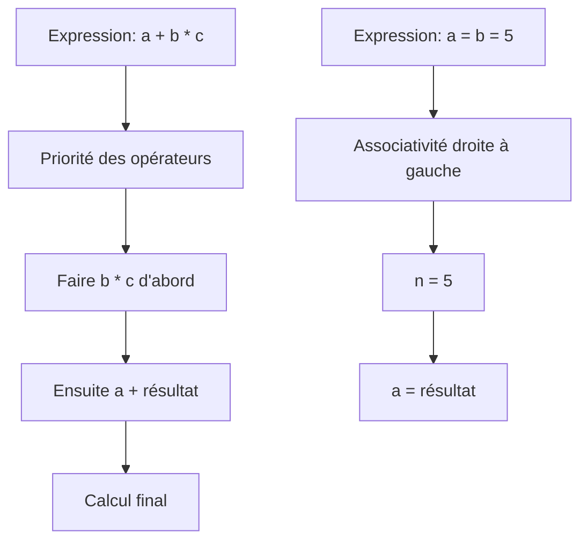

# Séance 2 : Les Fondamentaux du C (4 heures)

## Partie 2 : Opérateurs en C

### 6. Priorité et associativité des opérateurs

---

## 1. Concepts fondamentaux

En langage C, lorsque plusieurs opérateurs apparaissent dans une même expression, deux concepts déterminent l’ordre dans lequel ils sont évalués :

- **Priorité (ou précédence)** : définit quel opérateur est évalué en premier.
- **Associativité** : définit dans quel sens (gauche-à-droite ou droite-à-gauche) on évalue les opérateurs ayant la même priorité.

---

## 2. Importance de connaître la priorité et l’associativité

Cela permet de comprendre comment une expression complexe est évaluée sans ambigüité et d’éviter les erreurs de logique. Si nécessaire, on peut forcer l’ordre d’évaluation avec des parenthèses `()`.

---

## 3. Tableau simplifié des priorités et associativités courantes

| Priorité | Opérateurs                                     | Associativité     | Exemple                            |
|----------|-----------------------------------------------|------------------|----------------------------------|
| 1        | `()` (parenthèses)                            | -                | `(a + b) * c`                    |
| 2        | `++` (pré-incrément), `--` (pré-décrément), `!`, `~` (bitwise NOT), `+` (unary plus), `-` (unary minus) | Droite à gauche  | `-a`, `++i`                      |
| 3        | `*`, `/`, `%`                                | Gauche à droite  | `a * b / c`                     |
| 4        | `+`, `-`                                     | Gauche à droite  | `a + b - c`                     |
| 5        | `<`, `<=`, `>`, `>=`                         | Gauche à droite  | `a < b && b <= c`               |
| 6        | `==`, `!=`                                   | Gauche à droite  | `a == b`                       |
| 7        | `&&`                                         | Gauche à droite  | `a && b`                       |
| 8        | `||`                                         | Gauche à droite  | `a || b`                       |
| 9        | `=` (affectation) et opérateurs composés     | Droite à gauche  | `a = b = 5`                    |
| ...      | ...                                           | ...              | ...                            |

---

## 4. Exemplification avec une expression

```c
int a = 5, b = 10, c = 15;
int resultat;

resultat = a + b * c;
```

**Évaluation :**

- `*` a une priorité plus élevée que `+`.
- Donc `b * c` est calculé en premier (10 * 15 = 150).
- Ensuite `a + 150` est évalué → `5 + 150 = 155`.

---

Si on souhaite changer l’ordre :

```c
resultat = (a + b) * c;
```

Ici la parenthèse force `a + b` à s’évaluer avant la multiplication :

- `(5 + 10) * 15 = 15 * 15 = 225`.

---

## 5. Associativité démontrée

```c
int x = 10, y = 5, z = 2;
int valeur;

// Opérateurs gauche à droite
valeur = x - y - z; // ((10 - 5) - 2) = 3

// Opérateurs droite à gauche
int m, n;
m = n = 7;  // m = (n = 7) donc n d'abord affecté, puis m
```

---

## 6. Diagramme Mermaid : Priorité et associativité



---

## 7. Synthèse rapide à retenir

- Les opérations entre parenthèses ont toujours la priorité.
- Les opérateurs unaires (comme `!`, `++`) sont évalués avant les binaires (`+`, `*`).
- Multiplication, division, modulo privilégient avant addition et soustraction.
- Opérateurs logiques et relationnels ont des priorités plus faibles que les arithmétiques.
- Les affectations sont toujours évaluées en dernier (droite à gauche associativité).
- Utilisez les parenthèses pour clarifier les expressions complexes.

---

## 8. Sources utilisées

- cppreference.com - [Operator precedence](https://en.cppreference.com/w/c/language/operator_precedence)  
- ISO/IEC 9899:2018 (C18 Standard) - Section 6.5  
- TutorialsPoint - [C Operator Precedence and Associativity](https://www.tutorialspoint.com/cprogramming/c_operators_precedence.htm)  
- GNU GCC Documentation - [Expressions](https://gcc.gnu.org/onlinedocs/gcc/Expressions.html)  

---

Bien comprendre la priorité et l’associativité des opérateurs en C permet d’éviter des erreurs subtiles lors de l’écriture d’expressions et assure que le code s’exécute conformément aux attentes.