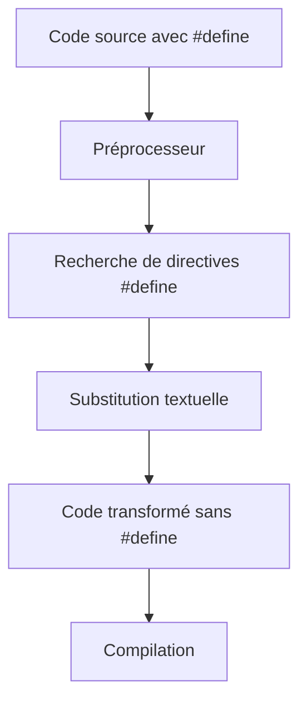

# Séance 2 : Les Fondamentaux du C (4 heures)

## Partie 4 : Les Constantes

### 2. Constantes symboliques avec `#define`

---

## 1. Présentation de `#define`

Le **préprocesseur C** propose la directive `#define` pour définir des **constantes symboliques** (ou macros simples). Ces constantes sont des identifiants remplacés par une valeur ou une expression lors de la phase de précompilation, avant la compilation proprement dite.

Syntaxe générale :

```c
#define NOM_CONSTANTE valeur
```

Autrement dit, chaque occurrence de `NOM_CONSTANTE` dans le code source sera remplacée textuellement par `valeur`.

---

## 2. Pourquoi utiliser `#define` pour les constantes ?

- Améliorer la lisibilité du code (ex : utiliser des noms explicites au lieu de nombres magiques).
- Centraliser les valeurs modifiables facilement.
- Faciliter la maintenance, car la modification dans la directive `#define` se propage partout.
- Minimiser les erreurs liées à la saisie répétée de valeurs.

---

## 3. Exemples d’utilisation simple

```c
#include <stdio.h>

#define TAILLE_MAX 100
#define TAUX_TVA 0.20

int main() {
    int tableau[TAILLE_MAX];
    float prix_ht = 50.0;
    float prix_ttc = prix_ht * (1 + TAUX_TVA);

    printf("Prix TTC : %.2f\n", prix_ttc);
    printf("Taille maximum du tableau : %d\n", TAILLE_MAX);

    return 0;
}
```

- Remarques :  
  - `TAILLE_MAX` est remplacé par `100` partout dans le code.  
  - `TAUX_TVA` est remplacé par `0.20`.

---

## 4. Précautions et limitations

- **Pas de type défini :** La constante est une substitution textuelle, sans contrôle de type.
- **Parenthèses recommandées autour des expressions :**  
  Pour éviter des erreurs lors d’expressions, entourez la valeur d’une constante symbolique par des parenthèses.  
  Exemple incorrect :  
  ```c
  #define PI 3.14
  #define RAYON 5
  double surface = PI * RAYON * RAYON; // OK ici
  #define DOUBLE(x) x + x
  int val = DOUBLE(2) * 3; // Évalué en 2 + 2 * 3 = 8 au lieu de 12 car pas de parenthèses
  ```
  Correct :  
  ```c
  #define DOUBLE(x) ((x) + (x))
  ```

- **Pas de constantes typées :** `const` permet de définir des constantes avec typage, `#define` est purement textuel.

- **Pas visible dans le débogueur** : Ces constantes n’existent pas en mémoire, donc impossible à visualiser pendant le debug.

---

## 5. Utilisation avancée : macros fonctionnelles

On peut créer des macros acceptant des arguments :

```c
#define MAX(a, b) ((a) > (b) ? (a) : (b))

int m = MAX(5, 10);  // Résultat : 10
```

Attention à bien protéger les arguments et tout l’expression par des parenthèses.

---

## 6. Diagramme Mermaid : fonctionnement de `#define`



---

## 7. Différence entre `#define` et `const`

| Caractéristique       | `#define`                             | `const`                       |
|----------------------|-------------------------------------|------------------------------|
| Nature               | Substitution textuelle précompilée | Variable constante typée      |
| Type de données       | Aucun, texte brut                   | Fortement typée              |
| Visibilité dans debugger | Non                               | Oui                          |
| Espace mémoire       | Aucun si simple constante           | Allocation mémoire           |
| Portée                | Globale dans le fichier              | Locale ou globale selon déclaration |
| Utilisation principale | Constantes symboliques simples      | Constantes numériques typées  |

---

## 8. Sources utilisées

- cppreference.com - [#define](https://en.cppreference.com/w/c/preprocessor/replace)  
- ISO/IEC 9899:2018 (C18 Standard) - Chapitre 6.10 (Directives du préprocesseur)  
- TutorialsPoint - [C Macro Definition (#define)](https://www.tutorialspoint.com/cprogramming/c_macros.htm)  
- GNU GCC Documentation - [Preprocessor](https://gcc.gnu.org/onlinedocs/cpp/Invocation.html)  

---

L'usage de `#define` permet d'améliorer la lisibilité et la maintenance du code à travers des constantes symboliques, tout en imposant des règles précises pour éviter des substitutions incorrectes lors de la compilation.