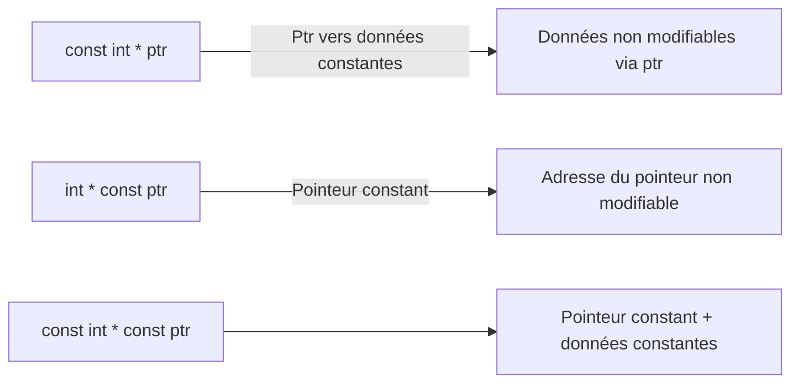

# Séance 2 : Les Fondamentaux du C (4 heures)

## Partie 4 : Les Constantes

### 3. Constantes avec `const` (variables en lecture seule)

---

## 1. Définition de `const`

Le mot-clé `const` en langage C permet de déclarer des variables **en lecture seule**. Une fois initialisée, la valeur de cette variable ne peut plus être modifiée durant l’exécution du programme.

Contrairement aux constantes définies avec `#define`, les variables `const` sont typées et intégrées au langage, ce qui facilite la sûreté du code et la traçabilité lors du débogage.

---

## 2. Syntaxe et utilisation basique

```c
const int age = 30;
const float pi = 3.14159;
```

- `age` et `pi` sont des variables dont la valeur ne peut pas être modifiée après leur affectation initiale.
- Toute tentative de modification du contenu d’une variable `const` génère une erreur de compilation.

---

## 3. Avantages des variables `const`

| Points forts                       | Explications                              |
|----------------------------------|------------------------------------------|
| Typage et vérification au moment de la compilation | Le compilateur contrôle le type et interdit les modifications inattendues |
| Visibilité au débogage           | Contrairement à `#define`, la variable apparaît en mémoire et peut être inspectée |
| Portée contrôlable               | Peut être locale, globale ou statique à un fichier |
| Compatible avec les pointeurs    | Permet de déclarer des pointeurs vers des données constantes ou pointeurs constants |

---

## 4. Exemple illustratif

```c
#include <stdio.h>

int main() {
    const int MAX_CLIENTS = 100;
    const double TAUX_INTERET = 0.05;

    printf("Nombre max de clients : %d\n", MAX_CLIENTS);
    printf("Taux d'intérêt : %.2f%%\n", TAUX_INTERET * 100);

    // MAX_CLIENTS = 101; // Erreur de compilation : modification interdite

    return 0;
}
```

---

## 5. `const` et pointeurs

### Pointeur vers données constantes

```c
const int x = 10;
const int *ptr = &x;

// *ptr = 20; // Erreur : modification interdite via ptr
```

### Pointeur constant vers données modifiables

```c
int y = 5;
int *const ptr2 = &y;

*ptr2 = 10; // OK, modifie y
// ptr2 = NULL; // Erreur : ptr2 est constant, son adresse ne peut changer
```

### Pointeur constant vers données constantes

```c
const int z = 3;
const int *const ptr3 = &z;

// *ptr3 = 4; // Erreur
// ptr3 = NULL; // Erreur
```

---

## 6. Diagramme Mermaid : relation const et pointeurs



---

## 7. Différences entre `#define` et `const`

| Critère           | `#define`                          | `const`                              |
|-------------------|----------------------------------|------------------------------------|
| Nature            | Substitution textuelle préprocesseur | Variable typée en lecture seule    |
| Type              | Aucun type                      | Type explicite                     |
| Visibilité debug   | Non                             | Oui                               |
| Utilisation mémoire | Non (remplacée lors précompilation) | Existe en mémoire                   |
| Portée            | Globale dans le fichier           | Peut être locale ou globale         |
| Sécurité          | Moins sûr, pas de vérification    | Plus sûr avec vérification type lors compilation |

---

## 8. Conseils d’utilisation

- Préférer `const` quand la constante doit avoir un type et une portée précise.
- Utiliser `const` avec des pointeurs pour protéger les données et l’adresse selon le contexte.
- Associer `const` à `static` permet de limiter la portée au fichier (visibilité interne).
- Ne pas confondre `const` et `#define` : ils ont des usages différents.

---

## 9. Sources utilisées

- cppreference.com - [const qualifier](https://en.cppreference.com/w/c/language/const)  
- ISO/IEC 9899:2018 (C18 Standard) - Chapitre 6.7.3 (Type qualifiers)  
- TutorialsPoint - [C Constant Qualifier](https://www.tutorialspoint.com/cprogramming/c_constant.htm)  
- GeeksforGeeks - [Const keyword in C](https://www.geeksforgeeks.org/const-keyword-in-c/)  

---

Les constantes définies avec `const` sont des variables sécurisées en lecture seule, permettant un contrôle de type et une meilleure traçabilité dans le programme, améliorant ainsi la maintenance et la robustesse du code.