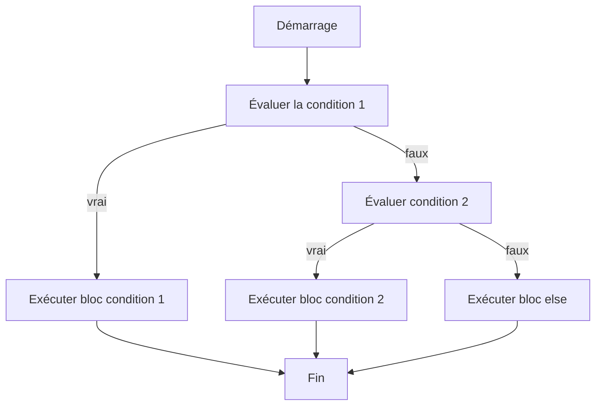

# Séance 3 : Structures de Contrôle (4 heures)

## Partie 1 : Les Conditions

### 1. L'instruction `if` : exécution conditionnelle

---

## 1. Présentation de `if`

L’instruction `if` en langage C permet d'exécuter une portion de code **uniquement si une condition est vraie**. C’est une structure de contrôle fondamentale pour contrôler le flux d’exécution selon des tests logiques.

Elle s’écrit sous la forme :

```c
if (condition) {
    // bloc de code exécuté si condition vraie
}
```

- La `condition` est une expression qui retourne une valeur entière.
- En C, une condition est considérée **vraie** si elle est non nulle, et **fausse** si elle vaut zéro.
- Le bloc entre accolades contient les instructions à exécuter si la condition est satisfaite.

---

## 2. Syntaxes courantes

### a) `if` simple

```c
if (x > 0) {
    printf("x est positif\n");
}
```

Si `x > 0` est vrai, le message s'affiche. Sinon, le bloc est ignoré.

### b) `if`…`else`

Permet d’exécuter un bloc alternatif si la condition est fausse.

```c
if (x % 2 == 0) {
    printf("x est pair\n");
} else {
    printf("x est impair\n");
}
```

### c) `if`…`else if`…`else`

Pour tester plusieurs conditions alternatives.

```c
if (score >= 90) {
    printf("Excellent\n");
} else if (score >= 75) {
    printf("Bien\n");
} else if (score >= 50) {
    printf("Passable\n");
} else {
    printf("Échec\n");
}
```

---

## 3. Particularités et bonnes pratiques

- **Les accolades sont indispensables** si le bloc contient plusieurs instructions.  
  Pour une seule instruction, elles sont optionnelles, mais recommandées pour la clarté.

- **L’expression conditionnelle peut utiliser des opérateurs relationnels et logiques**:  
  - Relationnels : `==`, `!=`, `<`, `>`, `<=`, `>=`.  
  - Logiques : `&&` (et), `||` (ou), `!` (non).

- **Attention à l’opérateur d’affectation `=` vs égalité `==`** dans la condition.

- **Priorité opérateurs** : utiliser des parenthèses pour clarifier les expressions complexes.

---

## 4. Exemples illustratifs

### Exemple 1 : Vérification d’un nombre positif

```c
#include <stdio.h>

int main() {
    int nombre;
    printf("Entrez un nombre : ");
    scanf("%d", &nombre);

    if (nombre > 0) {
        printf("Le nombre est positif.\n");
    } else if (nombre < 0) {
        printf("Le nombre est négatif.\n");
    } else {
        printf("Le nombre est nul.\n");
    }
    return 0;
}
```

### Exemple 2 : Validation d’un âge pour l’accès

```c
int age = 20;

if (age >= 18) {
    printf("Accès autorisé.\n");
} else {
    printf("Accès refusé.\n");
}
```

---

## 5. Diagramme Mermaid : fonctionnement d’un `if`…`else if`…`else`



---

## 6. Résumé

- L’instruction `if` contrôle l’exécution d’un bloc de code selon une condition booléenne.
- Elle peut être combinée avec `else` pour gérer des alternatives.
- On peut chaîner plusieurs conditions avec `else if`.
- Vérifier soigneusement la syntaxe (notamment `==` vs `=`).
- Toujours privilégier la lisibilité, en utilisant des accolades.

---

## 7. Sources utilisées

- cppreference.com - [if statement](https://en.cppreference.com/w/c/language/if)  
- ISO/IEC 9899:2018 - Chapitre 6.8.4.1  
- TutorialsPoint - [C - if else Statement](https://www.tutorialspoint.com/cprogramming/c_if_else_statement.htm)  
- GeeksforGeeks - [if-else Statement in C](https://www.geeksforgeeks.org/if-else-statement-in-c/)

---

L’instruction `if` est la base de la prise de décision dans un programme C, rendant possible un comportement dynamique et adaptatif selon les données et conditions rencontrées à l’exécution.