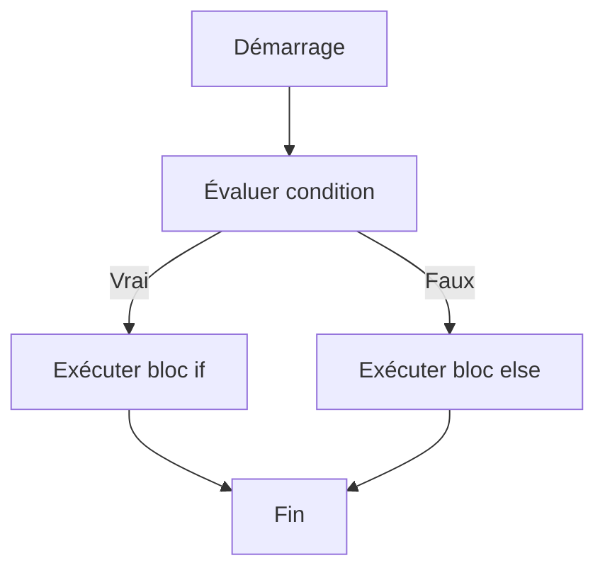

# Séance 3 : Structures de Contrôle (4 heures)

## Partie 1 : Les Conditions

### 2. `if-else` : choix entre deux alternatives

---

## 1. Principe de l'instruction `if-else`

L’instruction `if-else` permet de **choisir entre deux blocs d’instructions** selon la validité d’une condition.

- Si la condition est vraie (non nulle), le bloc situé après `if` est exécuté.
- Si la condition est fausse (zéro), c’est le bloc situé après `else` qui est exécuté.

Cette structure permet de gérer des décisions binaires simples dans un programme.

---

## 2. Syntaxe

```c
if (condition) {
    // Instructions exécutées si condition vraie
} else {
    // Instructions exécutées si condition fausse
}
```

- La condition est une expression évaluée comme vraie ou fausse (vrai ≠ 0, faux = 0).
- Les blocs sont entourés d’accolades `{}` regroupant potentiellement plusieurs instructions.

---

## 3. Exemple basique

```c
#include <stdio.h>

int main() {
    int nombre;

    printf("Saisissez un nombre : ");
    scanf("%d", &nombre);

    if (nombre % 2 == 0) {
        printf("Le nombre est pair.\n");
    } else {
        printf("Le nombre est impair.\n");
    }

    return 0;
}
```

- La condition teste si le reste de la division par 2 vaut 0.
- L’alternative est affichée selon la parité.

---

## 4. Bonnes pratiques

- Utiliser des accolades même pour un seul instruction pour éviter des erreurs de lecture/modification.
  
  ```c
  if (x > 0)
      printf("Positif\n"); // Possible mais risqué avec ajout futur
  ```
  
- Vérifier la condition avec l’opérateur `==` pour l'égalité, ne pas confondre avec `=` (affectation).

---

## 5. Exemple avec des entiers et comparaison

```c
int age = 17;

if (age >= 18) {
    printf("Vous êtes majeur.\n");
} else {
    printf("Vous êtes mineur.\n");
}
```

---

## 6. Diagramme Mermaid : fonctionnement de `if-else`



---

## 7. Étendue de la condition

- Condition peut combiner plusieurs expressions grâce aux opérateurs logiques :
  - `&&` : ET logique
  - `||` : OU logique
  - `!` : NON logique

```c
if (x > 0 && x < 10) {
    printf("x est entre 1 et 9\n");
} else {
    printf("x est hors de cet intervalle\n");
}
```

---

## 8. Sources utilisées

- cppreference.com - [if statement](https://en.cppreference.com/w/c/language/if)  
- ISO/IEC 9899:2018 - Chapitre 6.8.4.1  
- TutorialsPoint - [C if else Statement](https://www.tutorialspoint.com/cprogramming/c_if_else_statement.htm)  
- GeeksforGeeks - [if-else Statement in C](https://www.geeksforgeeks.org/if-else-statement-in-c/)

---

L’instruction `if-else` est un composant essentiel pour effectuer des choix dans un programme, permettant d’exécuter deux chemins d’exécution alternatifs selon le résultat d’une condition évaluée.