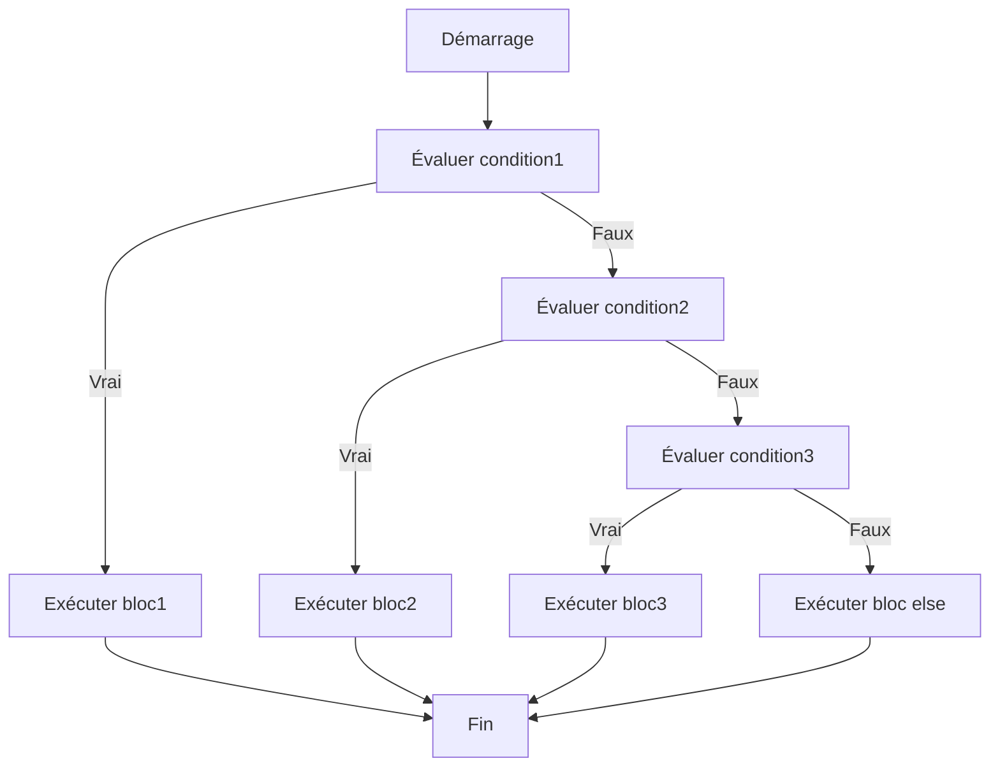

# Séance 3 : Structures de Contrôle (4 heures)

## Partie 1 : Les Conditions

### 3. `if-else if-else` : choix multiples

---

## 1. Concept

La structure `if-else if-else` permet d’effectuer un **choix parmi plusieurs alternatives**, en testant plusieurs conditions successives.

- Le programme évalue chaque condition **dans l’ordre**.
- Dès qu’une condition est vraie, le bloc associé est exécuté, puis la structure est quittée.
- Si aucune condition n’est vraie, le bloc `else` (optionnel) est exécuté.

---

## 2. Syntaxe

```c
if (condition1) {
    // instructions si condition1 vraie
} else if (condition2) {
    // instructions si condition2 vraie
} else if (condition3) {
    // instructions si condition3 vraie
} else {
    // instructions si aucune condition vraie
}
```

- Le nombre de blocs `else if` est variable.
- Le bloc `else` est optionnel, il sert de valeur par défaut.

---

## 3. Exemple d’utilisation : évaluation d’une note

```c
#include <stdio.h>

int main() {
    int note;

    printf("Entrez la note : ");
    scanf("%d", &note);

    if (note >= 90) {
        printf("Mention : Excellent\n");
    } else if (note >= 75) {
        printf("Mention : Très bien\n");
    } else if (note >= 50) {
        printf("Mention : Passable\n");
    } else {
        printf("Mention : Échec\n");
    }

    return 0;
}
```

- Le programme teste la note d’un étudiant et affiche une mention selon plage de valeurs.

---

## 4. Remarques importantes

- Les conditions doivent être **mutuellement exclusives** ou bien ordonnées pour éviter des résultats inattendus.
- L’exécution s’arrête dès qu’une condition vraie est trouvée.
- Pour des cas précis, l’instruction `switch` peut être plus adaptée.

---

## 5. Diagramme Mermaid : fonctionnement d’un `if-else if-else`



---

## 6. Optimisation et alternatives

- Pour des tests sur la même variable avec constantes, privilégier l’instruction `switch` pour plus de lisibilité et d’optimisation.
- Après compilation, le `switch` est souvent plus performant que plusieurs `if-else if`.

---

## 7. Sources utilisées

- cppreference.com - [if statement](https://en.cppreference.com/w/c/language/if)  
- TutorialsPoint - [C if-else-if Statement](https://www.tutorialspoint.com/cprogramming/c_if_else_if_statement.htm)  
- GeeksforGeeks - [if-else ladder in C](https://www.geeksforgeeks.org/if-else-ladder-in-c-cpp-with-examples/)  
- ISO/IEC 9899:2018 (C18 standard) - Chapitre 6.8.4.1

---

La structure `if-else if-else` offre un mécanisme flexible pour gérer des choix multiples dans un programme, permettant d’orienter le flux d’exécution vers différentes réponses en fonction des conditions évaluées.