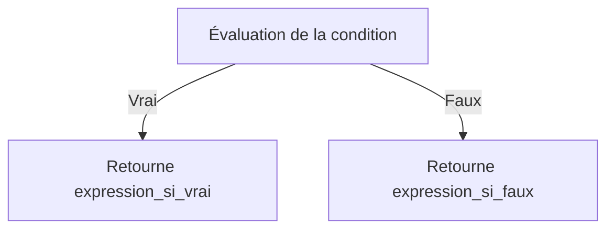
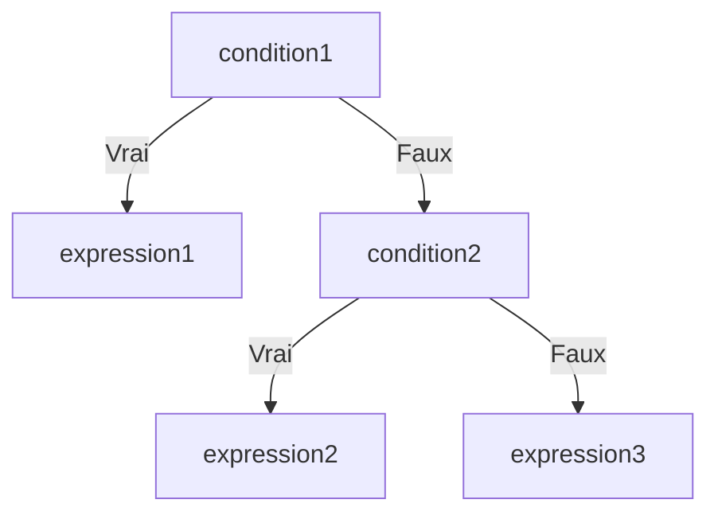

# Séance 3 : Structures de Contrôle (4 heures)

## Partie 1 : Les Conditions

### 5. L'opérateur ternaire `? :`

---

## 1. Présentation de l’opérateur ternaire

L'opérateur ternaire `? :` en langage C est une **forme abrégée de l’instruction conditionnelle `if-else`**. Il permet d’écrire une expression qui retourne une valeur selon une condition, en une seule ligne.

### Syntaxe générale

```c
(condition) ? expression_si_vrai : expression_si_faux;
```

- **condition** : expression évaluée comme vraie (non nulle) ou fausse (zéro).
- **expression_si_vrai** : valeur ou expression retournée si la condition est vraie.
- **expression_si_faux** : valeur ou expression retournée si la condition est fausse.

---

## 2. Utilisation et avantages

- Utilisé pour **simplifier et raccourcir** un test simple.
- Doit être utilisé lorsque le résultat conditionnel est une valeur ou une expression.
- Permet d'éviter des blocs `if-else` courts et gagner en concision.
- Compatible dans des expressions plus complexes (ex : affectations, arguments de fonction).

---

## 3. Exemples pratiques

### Exemple 1 : Affectation conditionnelle

```c
int x = 10, y = 20;
int max;

max = (x > y) ? x : y;
printf("Le maximum est %d\n", max);
```

Equivalent à :

```c
if (x > y) {
    max = x;
} else {
    max = y;
}
```

---

### Exemple 2 : Affichage conditionnel

```c
int age = 18;

printf("Vous êtes %s majeur.\n", (age >= 18) ? "un" : "un non");
```

---

### Exemple 3 : Ternaire imbriqué

```c
int note = 75;
const char *mention;

mention = (note >= 90) ? "Excellent" :
          (note >= 75) ? "Bien" :
          (note >= 50) ? "Passable" : "Échec";

printf("Mention : %s\n", mention);
```

---

## 4. Diagramme Mermaid : fonctionnement de l’opérateur ternaire



Pour un ternaire imbriqué :



---

## 5. Points importants

- L’opérateur ternaire est une **expression**, donc il peut être utilisé partout où une expression est valide (affectations, renvois de fonction, appels).
- La priorité de l’opérateur ternaire est faible, il est souvent nécessaire d’utiliser des parenthèses pour garantir l’ordre d’évaluation.
- Pour des conditions complexes ou incluant plusieurs instructions, privilégier le classique `if-else` pour la clarté.
- Attention à ne pas abuser du ternaire imbriqué, ce qui nuit à la lisibilité.

---

## 6. Sources utilisées

- [cppreference - Conditional operator (?:)](https://en.cppreference.com/w/c/language/operator_other#Conditional_operator)  
- [GeeksforGeeks - Ternary Operator in C](https://www.geeksforgeeks.org/ternary-operator-in-c/)  
- [TutorialsPoint - C Ternary Operator](https://www.tutorialspoint.com/cprogramming/c_operators.htm)  
- ISO/IEC 9899:2018 (C18) – Chapitre 6.5.15 (Conditional operator)

---

L’opérateur ternaire `? :` apporte une écriture compacte et efficace pour les choix simples dans les expressions, réduisant la verbosité du langage C tout en respectant la logique conditionnelle fondamentale.