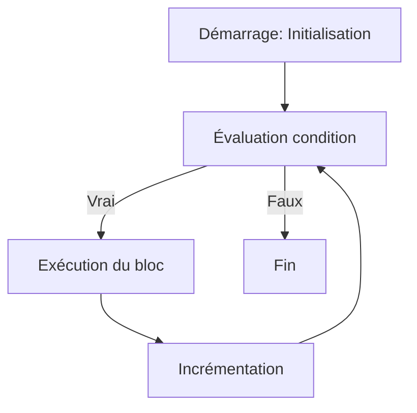

# Séance 3 : Structures de Contrôle (4 heures)

## Partie 2 : Les Boucles

### 1. La boucle `for` : idéale pour un nombre connu d'itérations

---

## 1. Présentation de la boucle `for`

La boucle `for` est une structure de contrôle itérative en langage C, conçue pour exécuter un bloc d’instructions un nombre précis ou connu à l'avance de fois.

Elle est particulièrement adaptée lorsque le **nombre d'itérations est déterminé** avant la boucle.

---

## 2. Syntaxe générale

```c
for (initialisation; condition; incrémentation) {
    // instructions à répéter
}
```

- **initialisation** : sert à initialiser la ou les variables de la boucle, exécutée une seule fois au début.
- **condition** : expression logiquement évaluée avant chaque itération ; tant qu’elle est vraie (non zéro), la boucle continue.
- **incrémentation** : mise à jour des variables de contrôle, exécutée après chaque itération.

---

## 3. Exemple simple : afficher les nombres de 0 à 9

```c
#include <stdio.h>

int main() {
    for (int i = 0; i < 10; i++) {
        printf("%d\n", i);
    }
    return 0;
}
```

- `i` est initialisé à 0.
- La boucle continue tant que `i < 10`.
- Après chaque exécution du corps, `i` est incrémenté de 1 (`i++`).

---

## 4. Exemple avec incrémentation personnalisée

Affichage des nombres pairs de 0 à 18 :

```c
for (int i = 0; i < 20; i += 2) {
    printf("%d ", i);
}
```

---

## 5. Fonctionnement détaillé

À chaque nouvelle itération :

1. La **condition** est évaluée.
2. Si vraie, le bloc instructions est exécuté.
3. L’instruction d’**incrémentation** est appliquée.
4. Retour à l’étape 1.

Si la condition est fausse, la boucle se termine.

---

## 6. Diagramme Mermaid : déroulement de la boucle `for`



---

## 7. Bonnes pratiques

- Déclarer la variable d’itération à l’intérieur du `for` si possible (`C99` et ultérieur) pour limiter sa portée.
- Bien définir la condition pour éviter les boucles infinies.
- Utiliser des types adaptés pour l’itérateur (`int`, `size_t` selon le contexte).
- Éviter de modifier la variable d'itération dans le corps de la boucle pour éviter des comportements imprévisibles.

---

## 8. Exemples avancés

### Somme des entiers de 1 à N

```c
int N = 100, somme = 0;
for (int i = 1; i <= N; i++) {
    somme += i;
}
printf("Somme = %d\n", somme);
```

### Utilisation de plusieurs variables dans la boucle

```c
for (int i = 0, j = 10; i < j; i++, j--) {
    printf("i = %d, j = %d\n", i, j);
}
```

---

## 9. Sources utilisées

- [cppreference.com - for loop](https://en.cppreference.com/w/c/language/for)  
- [TutorialsPoint - C for loop](https://www.tutorialspoint.com/cprogramming/c_for_loop.htm)  
- [GeeksforGeeks - for loop in C](https://www.geeksforgeeks.org/for-loop-in-c/)  
- ISO/IEC 9899:2018 (C18) – Chapitre 6.8.5.3 (for statement)  

---

La boucle `for` est un outil puissant en C pour itérer de façon claire et contrôlée lorsque le nombre de répétitions est déterminé. Son utilisation correcte favorise un code lisible et maintenable.