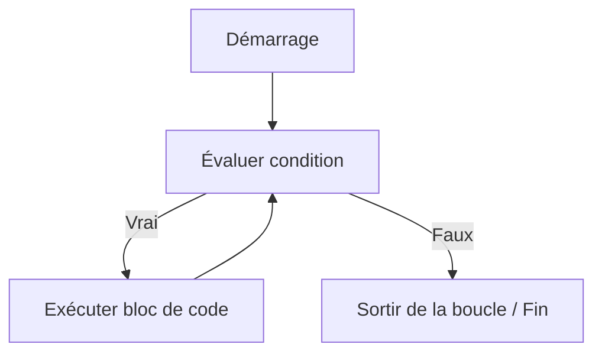

# Séance 3 : Structures de Contrôle (4 heures)

## Partie 2 : Les Boucles

### 2. La boucle `while` : répétition tant qu'une condition est vraie

---

## 1. Principe de la boucle `while`

La boucle `while` en langage C exécute un bloc d’instructions **tant qu’une condition reste vraie**.

- La condition est évaluée **avant l’exécution du bloc** à chaque itération.
- Si la condition est fausse initialement, le corps de la boucle ne sera pas exécuté.
- Utile lorsque le nombre d’itérations n’est pas connu à l’avance, ou dépend de l’évolution du programme.

---

## 2. Syntaxe générale

```c
while (condition) {
    // instructions répétées
}
```

- `condition` : expression évaluée comme vraie (non zéro) ou fausse (zéro).
- Le corps de boucle s’exécute tant que la condition est vraie.

---

## 3. Exemple simple : compteur croissant

```c
#include <stdio.h>

int main() {
    int compteur = 0;

    while (compteur < 5) {
        printf("Compteur = %d\n", compteur);
        compteur++;  // Important de modifier la variable pour éviter boucle infinie
    }

    return 0;
}
```

- La boucle s’arrête lorsque `compteur` vaut 5 (condition fausse).
- La variable est incrémentée à chaque tour.

---

## 4. Exemple pratique : lecture sécurisée d’une saisie

```c
#include <stdio.h>

int main() {
    int age;

    printf("Entrez votre âge (>= 0) : ");
    scanf("%d", &age);

    while (age < 0) {
        printf("Erreur. Entrez un âge valide (>= 0) : ");
        scanf("%d", &age);
    }

    printf("Âge validé : %d\n", age);

    return 0;
}
```

- La boucle `while` permet de répéter la demande jusqu’à une saisie correcte.

---

## 5. Diagramme Mermaid : fonctionnement de la boucle `while`



---

## 6. Points clés et bonnes pratiques

- **Prévenir une boucle infinie** : Assurer que la condition devienne fausse à un moment.
- La variable testée dans la condition doit être modifiée dans le corps.
- Préférer `while` quand le nombre d’itérations est **inconnu** ou dépend d’événements.
- Pour des itérations à nombre fixe, la boucle `for` est généralement plus lisible.

---

## 7. Exemple avancé : boucle sur une condition dynamique

Calcul de la somme cumulée tant que la somme est inférieure à 100 :

```c
int somme = 0;
int valeur = 0;

while (somme < 100) {
    printf("Entrez un entier : ");
    scanf("%d", &valeur);
    somme += valeur;
    printf("Somme actuelle : %d\n", somme);
}
```

---

## 8. Sources utilisées

- [cppreference.com - while statement](https://en.cppreference.com/w/c/language/while)  
- [TutorialsPoint - C While Loop](https://www.tutorialspoint.com/cprogramming/c_while_loop.htm)  
- [GeeksforGeeks - while Loop in C](https://www.geeksforgeeks.org/while-loop-in-c/)  
- ISO/IEC 9899:2018 (C18 standard) – Chapitre 6.8.5.2 (while statement)

---

La boucle `while` offre une manière naturelle de répéter un bloc d’instructions tant qu’une condition contrôlant la répétition reste vraie, particulièrement utile pour des boucles dont la durée dépend de l’évolution des données pendant l’exécution.