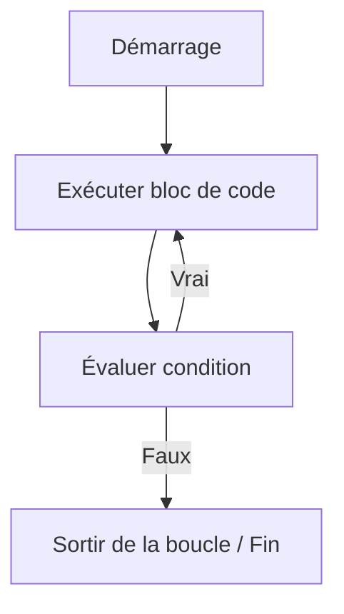

# Séance 3 : Structures de Contrôle (4 heures)

## Partie 2 : Les Boucles

### 3. La boucle `do-while` : exécution au moins une fois

---

## 1. Principe de la boucle `do-while`

La boucle `do-while` est une structure itérative particulière du langage C qui garantit que le bloc d’instructions s’exécute **au moins une fois**, car la condition est évaluée **après l’exécution du bloc**.

- Le corps de la boucle s’exécute d’abord, puis la condition est testée.
- La boucle continue tant que la condition est vraie.
- Appropriée pour des situations où le bloc doit s’exécuter une ou plusieurs fois avant de tester la condition.

---

## 2. Syntaxe générale

```c
do {
    // instructions à répéter
} while (condition);
```

- Le point-virgule à la fin est obligatoire.
- La condition est évaluée après chaque exécution du bloc.

---

## 3. Exemples d'utilisation

### Exemple 1 : Saisie d’un nombre positif

```c
#include <stdio.h>

int main() {
    int nombre;

    do {
        printf("Entrez un nombre positif : ");
        scanf("%d", &nombre);
    } while (nombre < 0);

    printf("Nombre validé : %d\n", nombre);

    return 0;
}
```

- Le message est affiché et la saisie est faite au moins une fois.
- La vérification se fait après chaque saisie, répétant la demande en cas de valeur négative.

---

### Exemple 2 : Menu simple avec sortie

```c
#include <stdio.h>

int main() {
    int choix;

    do {
        printf("Menu:\n1. Option A\n2. Option B\n3. Quitter\n");
        printf("Choisissez une option : ");
        scanf("%d", &choix);

        switch (choix) {
            case 1:
                printf("Option A sélectionnée.\n");
                break;
            case 2:
                printf("Option B sélectionnée.\n");
                break;
            case 3:
                printf("Fin du programme.\n");
                break;
            default:
                printf("Option invalide.\n");
        }
    } while (choix != 3);

    return 0;
}
```

---

## 4. Diagramme Mermaid : fonctionnement de la boucle `do-while`



---

## 5. Comparaison avec `while`

| Aspect                    | `while`                           | `do-while`                        |
|---------------------------|---------------------------------|----------------------------------|
| Condition évaluée         | Avant l'exécution                | Après l'exécution                |
| Exécution minimum         | 0 (peut ne jamais s'exécuter)   | 1 (toujours exécutée au moins une fois) |
| Usage typique             | Boucle contrôlée par condition  | Boucle nécessitant une exécution initiale obligatoire |

---

## 6. Bonnes pratiques

- Utiliser la boucle `do-while` quand le traitement doit être effectué au moins une fois, comme les saisies utilisateurs.
- Veiller à transformer la condition pour éviter des boucles infinies.
- Éviter d’abuser en imbriquant trop de boucles `do-while` pour maintenir la lisibilité.

---

## 7. Sources utilisées

- [cppreference.com - do-while statement](https://en.cppreference.com/w/c/language/do)  
- [TutorialsPoint - C do-while Loop](https://www.tutorialspoint.com/cprogramming/c_do_while_loop.htm)  
- [GeeksforGeeks - do-while loop in C](https://www.geeksforgeeks.org/do-while-loop-in-c/)  
- ISO/IEC 9899:2018 (C18 standard) – Chapitre 6.8.5.1 (do-while statement)

---

La boucle `do-while` permet d’assurer une première exécution du bloc de code avant de vérifier une condition, utile notamment dans les situations où une action doit être réalisée au moins une fois avant de décider de poursuivre ou non.