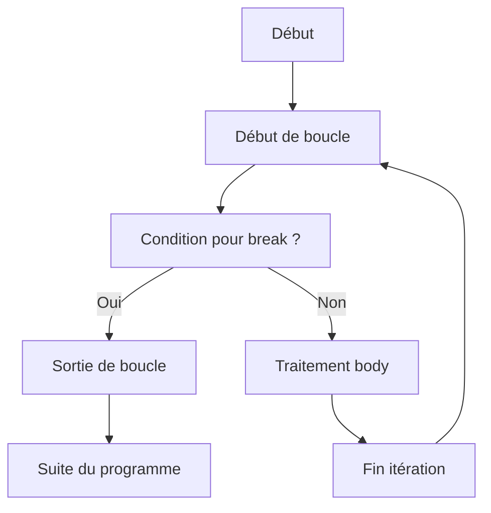

# Séance 3 : Structures de Contrôle (4 heures)

## Partie 3 : Instructions de Saut

### 1. `break` : sortir d'une boucle ou d'un `switch`

---

## 1. Présentation de l’instruction `break`

L’instruction `break` en langage C est utilisée pour **interrompre immédiatement l’exécution d’une boucle (`for`, `while`, `do-while`) ou d’une instruction `switch`**, et passer directement à la première instruction après cette structure.

C’est un outil simple et efficace pour sortir prématurément d’une boucle ou d’un `switch` selon une condition spécifique.

---

## 2. Utilisation principale

- **Dans les boucles**, permet de sortir avant la fin naturelle lorsque la condition définie est remplie.
- **Dans les `switch`**, termine le bloc et empêche la poursuite dans les cases suivantes (évite le « fall-through »).

---

## 3. Syntaxe

```c
break;
```

- L’instruction ne prend pas d’argument.
- Se place à l’intérieur des blocs `for`, `while`, `do-while` ou `switch`.

---

## 4. Exemples pratiques

### Exemple 1 : Sortir d’une boucle `for` au premier multiple trouvé

```c
#include <stdio.h>

int main() {
    int i;

    for (i = 1; i <= 100; i++) {
        if (i % 7 == 0) {
            printf("Premier multiple de 7 trouvé : %d\n", i);
            break;  // sortie immédiate
        }
    }

    printf("Boucle terminée après break.\n");
    return 0;
}
```

---

### Exemple 2 : Utilisation dans un `switch`

```c
#include <stdio.h>

int main() {
    char option = 'b';

    switch (option) {
        case 'a':
            printf("Option A sélectionnée\n");
            break;
        case 'b':
            printf("Option B sélectionnée\n");
            break;
        default:
            printf("Option inconnue\n");
    }

    return 0;
}
```

Sans `break`, toutes les instructions suivantes seraient exécutées jusqu’à la fin du `switch`.

---

## 5. Diagramme Mermaid : comportement de `break` dans une boucle



---

## 6. Points importants

- Utiliser `break` pour **simplifier** des boucles avec conditions d'arrêt multiples.
- Permet un contrôle fin du flux d’exécution, évitant des conditions imbriquées complexes.
- Ne pas abuser de `break` car il peut parfois nuire à la lisibilité si utilisé de manière excessive.
- Dans un `switch`, le `break` est indispensable pour éviter l’exécution des cas suivants.

---

## 7. Sources utilisées

- [cppreference.com - break statement](https://en.cppreference.com/w/c/language/break)  
- [GeeksforGeeks - break statement in C](https://www.geeksforgeeks.org/break-statement-in-c/)  
- [TutorialsPoint - C break Statement](https://www.tutorialspoint.com/cprogramming/c_break_statement.htm)  
- ISO/IEC 9899:2018 (C18) – Chapitre 6.8.6.1 (break statement)

---

L’instruction `break` permet de sortir immédiatement d’une boucle ou d'un bloc `switch`, offrant une maîtrise explicite du déroulement du programme. Utilisée à bon escient, elle optimise la gestion du contrôle de flux dans le code C.