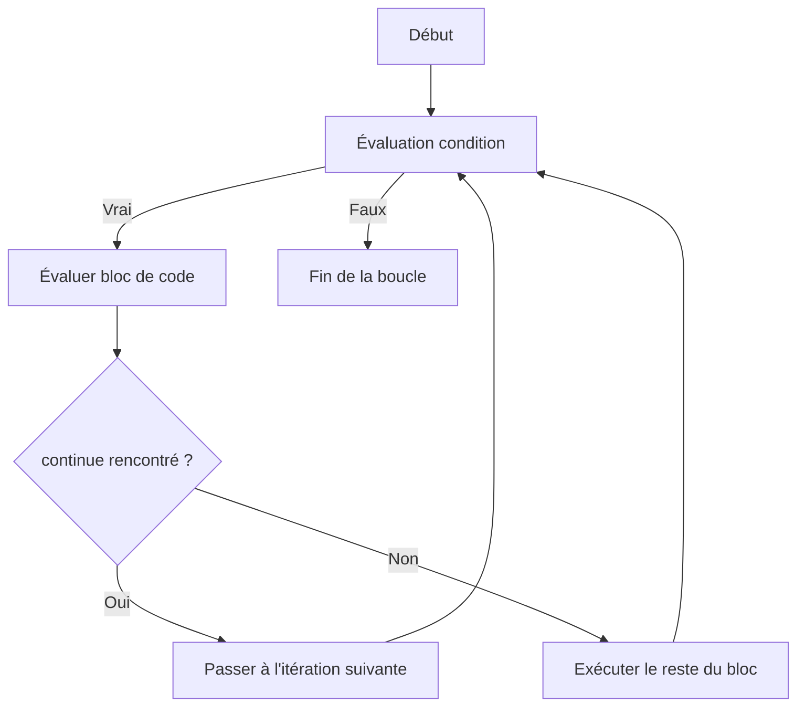

# Séance 3 : Structures de Contrôle (4 heures)

## Partie 3 : Instructions de Saut

### 2. `continue` : passer à l'itération suivante d'une boucle

---

## 1. Présentation de l’instruction `continue`

L’instruction `continue` en langage C interrompt l’exécution **du reste du corps de la boucle en cours** et force le programme à passer immédiatement à l’itération suivante.

Elle s’utilise uniquement à l’intérieur des boucles (`for`, `while`, `do-while`) et modifie ainsi le flux normal d’exécution sans sortir de la boucle.

---

## 2. Fonctionnement

- Lorsqu’un `continue` est rencontré, le programme saute les instructions restantes du bloc courant.
- Le mécanisme d’incrémentation ou de mise à jour dans une boucle `for` est tout de même exécuté, avant de revenir à l’évaluation de la condition.
- Dans une boucle `while` ou `do-while`, la condition est évaluée directement après.

---

## 3. Syntaxe

```c
continue;
```

- Doit être utilisé à l’intérieur d’une boucle.
- Ne prend pas d’arguments.

---

## 4. Exemples d’utilisation

### Exemple 1 : Ignorer les nombres pairs dans un affichage

```c
#include <stdio.h>

int main() {
    for (int i = 0; i < 10; i++) {
        if (i % 2 == 0) {
            continue;  // passer à l'itération suivante
        }
        printf("%d ", i);
    }
    printf("\n");
    return 0;
}
```

Résultat :  
```
1 3 5 7 9
```

Les nombres pairs ne sont pas affichés car `continue` empêche l’exécution du `printf` dans ces cas.

---

### Exemple 2 : Sauter une itération dans une boucle `while`

```c
#include <stdio.h>

int main() {
    int i = 0;

    while (i < 10) {
        i++;
        if (i == 5) {
            continue;  // la valeur 5 ne sera pas affichée
        }
        printf("%d ", i);
    }
    printf("\n");
    return 0;
}
```

---

## 5. Diagramme Mermaid : comportement de `continue`



---

## 6. Points à retenir

- `continue` **n’interrompt pas la boucle**, seulement l’itération en cours.
- Permet d’éviter d’imbrication excessive et d’augmenter la lisibilité.
- Diffère de `break` qui **quitte définitivement** la boucle.
- Utilisé avec précaution, il peut clarifier le flux de contrôle dans des boucles complexes.

---

## 7. Sources utilisées

- [cppreference.com - continue statement](https://en.cppreference.com/w/c/language/continue)  
- [GeeksforGeeks - continue statement in C](https://www.geeksforgeeks.org/continue-statement-in-c/)  
- [TutorialsPoint - C continue Statement](https://www.tutorialspoint.com/cprogramming/c_continue_statement.htm)  
- ISO/IEC 9899:2018 (C18) – Chapitre 6.8.6.2 (continue statement)

---

L’instruction `continue` offre un moyen simple et précis de passer à l’itération suivante d’une boucle sans exécuter le reste des instructions du bloc, facilitant ainsi la gestion fine des conditions dans les structures répétitives.