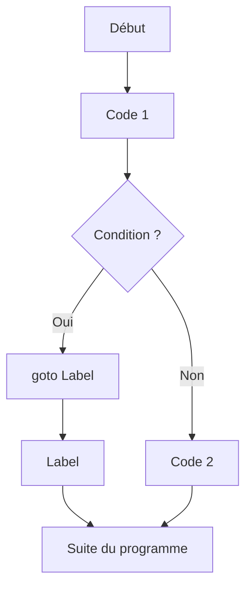

# Séance 3 : Structures de Contrôle (4 heures)

## Partie 3 : Instructions de Saut

### 3. L'instruction `goto` (déconseillée, à éviter sauf cas très spécifiques)

---

## 1. Présentation de l’instruction `goto`

L'instruction `goto` en langage C permet un saut inconditionnel vers une autre partie du code identifiée par une étiquette (label). Elle modifie le flux normal d’exécution et peut faire sauter plusieurs lignes de code en une seule instruction.

**Syntaxe générale :**

```c
goto label;
...
label:
    // instructions ciblées
```

---

## 2. Pourquoi `goto` est déconseillée ?

- **Risque d’un code spaghetti**, difficile à lire, à maintenir et à déboguer.
- Rend le flux de contrôle **non structuré**, ce qui complexifie la compréhension.
- La plupart des cas d’utilisation sont mieux gérés par des structures de contrôle (boucles, fonctions, conditions).
- N’encourage pas les bonnes pratiques en programmation structurée.

---

## 3. Cas d’usage valides

Bien que déconseillée, `goto` est encore utilisée dans des cas très spécifiques, notamment :

- Gestion des erreurs et nettoyage des ressources dans des fonctions à plusieurs points d'échec (pattern de "cleanup" en C).
- Sortie rapide multiple d’une fonction ayant plusieurs blocs imbriqués, quand les alternatives seraient beaucoup plus verbeuses.
- Programmation système ou bas niveau nécessitant une optimisation très fine.

---

## 4. Exemples

### Exemple 1 : Utilisation classique de `goto` pour la gestion d’erreur

```c
#include <stdio.h>
#include <stdlib.h>

int fonction() {
    int *ptr = malloc(sizeof(int) * 10);
    if (!ptr) goto erreur;

    // Traitement...
    if (/* autre condition d'erreur */ 0) goto erreur_free;

    free(ptr);
    return 0;

erreur_free:
    free(ptr);
erreur:
    printf("Erreur détectée.\n");
    return -1;
}

int main() {
    fonction();
    return 0;
}
```

- Ici, `goto` évite la duplication du nettoyage `free(ptr)` dans plusieurs points d’erreur.

---

### Exemple 2 : Saut simple (à éviter)

```c
#include <stdio.h>

int main() {
    int i = 0;
    debut:
    printf("i = %d\n", i);
    i++;
    if (i < 5) goto debut;  // boucle par goto (peu lisible)
    return 0;
}
```

Cette structure est équivalente à une boucle `while` ou `for`, mais nettement moins claire.

---

## 5. Diagramme Mermaid : illustration du flux avec `goto`



---

## 6. Alternatives à `goto`

- Boucles `for`, `while`, `do-while` pour le contrôle répétitif.
- Instructions conditionnelles (`if`, `switch`) pour les choix.
- Fonctions pour séparer les traitements et éviter les répétitions.
- Structures de gestion d’erreurs comme les codes retour et `if` imbriqués.

---

## 7. Sources utilisées

- [cppreference.com - goto statement](https://en.cppreference.com/w/c/language/goto)  
- [GeeksforGeeks - goto statement in C](https://www.geeksforgeeks.org/goto-statement-in-c-with-examples/)  
- [TutorialsPoint - C goto Statement](https://www.tutorialspoint.com/cprogramming/c_goto_statement.htm)  
- ISO/IEC 9899:2018 (C18) – Chapitre 6.8.6.3 (goto statement)

---

## 8. Conclusion

L'instruction `goto` modifie directement le flux d'exécution, mais son usage est fortement déconseillé à cause des problèmes de lisibilité et de maintenance qu’elle provoque. Il convient de privilégier les structures de contrôle classiques, et réserver `goto` uniquement à certains cas spécifiques, notamment pour la gestion centralisée des erreurs dans des fonctions complexes.

---

Ce module souligne l’importance d’écrire un code clair, maîtrisable, et structuré, en limitant autant que possible les changements arbitraires du flux d’exécution.