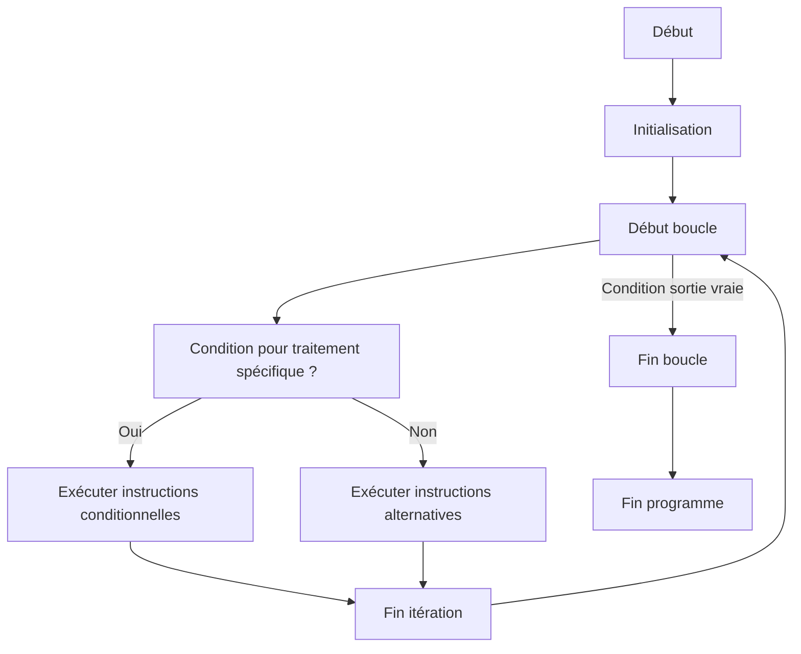

# Séance 3 : Structures de Contrôle (4 heures)

## Partie 4 : Exercices Guidés de Structures de Contrôle

### 1. Exemples d'utilisation combinée des conditions et boucles

---

## 1. Introduction

Combiner **conditions** (`if`, `switch`) et **boucles** (`for`, `while`, `do-while`) est courant pour résoudre des problèmes nécessitant des itérations avec des contrôles complexes.

Cette synergie permet de :

- Exécuter certaines actions uniquement dans des cas précis.
- Contrôler le flux d’exécution à chaque étape d’une boucle.
- Effectuer des traitements répétitifs tout en adaptant le comportement en fonction des données.

---

## 2. Exemples pratiques

### Exemple 1 : Saisie contrôlée avec boucle `do-while` et condition `if`

**Contexte :** Demander à l’utilisateur de saisir un nombre jusqu’à ce qu’il entre un nombre entre 1 et 10.

```c
#include <stdio.h>

int main() {
    int nombre;

    do {
        printf("Entrez un nombre entre 1 et 10 : ");
        scanf("%d", &nombre);

        if (nombre < 1 || nombre > 10) {
            printf("Nombre invalide. Réessayez.\n");
        }

    } while (nombre < 1 || nombre > 10);

    printf("Vous avez entré %d.\n", nombre);
    return 0;
}
```

- La boucle assure la répétition.
- La condition dans la boucle vérifie la validité.

---

### Exemple 2 : Somme des nombres pairs jusqu’à 100 avec boucle `for` et test `if`

```c
#include <stdio.h>

int main() {
    int somme = 0;

    for (int i = 1; i <= 100; i++) {
        if (i % 2 == 0) {
            somme += i;
        }
    }

    printf("La somme des nombres pairs de 1 à 100 est %d.\n", somme);
    return 0;
}
```

- La boucle itère de 1 à 100.
- Le `if` filtre les nombres pairs.

---

### Exemple 3 : Menu interactif simple avec `do-while` et `switch`

```c
#include <stdio.h>

int main() {
    int choix;

    do {
        printf("Menu:\n1. Dire bonjour\n2. Dire au revoir\n3. Quitter\n");
        printf("Choisissez une option: ");
        scanf("%d", &choix);

        switch (choix) {
            case 1:
                printf("Bonjour !\n");
                break;
            case 2:
                printf("Au revoir !\n");
                break;
            case 3:
                printf("Fin du programme.\n");
                break;
            default:
                printf("Option invalide.\n");
        }
    } while (choix != 3);

    return 0;
}
```

- La boucle permet à l’utilisateur de faire plusieurs choix successifs.
- Le `switch` gère les différentes options.

---

## 3. Diagramme Mermaid résumant la combinaison boucle-condition



---

## 4. Conseils pratiques

- Toujours vérifier que la condition d’arrêt de la boucle est claire et atteignable.
- Utiliser les conditions pour filtrer et orienter le traitement à l’intérieur de la boucle.
- Favoriser la lisibilité en ne surchargeant pas les boucles avec trop de conditions imbriquées.
- Commenter les cas particuliers dans les blocs conditionnels pour faciliter la maintenance.

---

## 5. Sources utilisées

- [cplusplus.com - Loops and Conditions](https://www.cplusplus.com/doc/tutorial/control/)
- [GeeksforGeeks - Loops and Conditionals in C](https://www.geeksforgeeks.org/loops-in-c/)
- [TutorialsPoint - C - Loop Control Statements](https://www.tutorialspoint.com/cprogramming/c_loop_control.htm)
- ISO/IEC 9899:2018 (C18) – Chapitres sur les boucles et conditions

---

La combinaison de boucles et de conditions permet de gérer efficacement un grand nombre de problèmes liés au contrôle du flux dans la programmation en C, notamment pour les interactions utilisateur, le traitement de données ou la gestion des choix multiples.