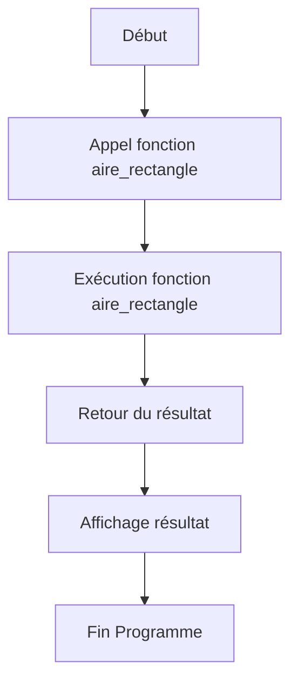

# Séance 4 : Fonctions et Modularité (4 heures)

## Partie 1 : Introduction aux Fonctions

### 1. Pourquoi utiliser des fonctions ?  
_(Réutilisabilité, modularité, lisibilité)_

---

## 1. Les fonctions : définition et rôle

Une fonction en langage C est un bloc de code nommé, conçu pour accomplir une tâche précise. Elle peut être appelée depuis d’autres parties du programme pour exécuter cette tâche sans reproduction de code.

---

## 2. Avantages majeurs des fonctions

### 2.1 Réutilisabilité

Les fonctions permettent de **réutiliser** un même morceau de code dans différentes parties d’un programme ou même dans différents projets. Cela évite la duplication et facilite la maintenance.

Exemple :

```c
#include <stdio.h>

int carre(int x) {
    return x * x;
}

int main() {
    int a = 5;
    printf("Carré de %d = %d\n", a, carre(a));
    printf("Carré de %d = %d\n", 10, carre(10));
    return 0;
}
```

On appelle la fonction `carre` plusieurs fois sans réécrire son code.

---

### 2.2 Modularité

Les fonctions permettent de **découper** un programme complexe en modules ou unités fonctionnelles, chacune avec une responsabilité claire.

- Facilite la conception et le test unitaire.
- Favorise la collaboration : chaque développeur peut travailler sur une fonction distincte.
- Encourage la répartition logique et la gestion des tâches.

---

### 2.3 Lisibilité

L’usage des fonctions renforce la **lisibilité** générale du code :

- Réduit la taille des blocs de code dans la fonction `main` ou autres fonctions principales.
- Clarifie le but du programme à travers le nom des fonctions.
- Facilite la lecture et la compréhension du flux d’exécution.

---

## 3. Illustration : Découpage fonctionnel et appel

Visualisons un programme simple qui calcule l’aire d’un rectangle.

```c
#include <stdio.h>

// Fonction qui calcule l'aire
int aire_rectangle(int largeur, int hauteur) {
    return largeur * hauteur;
}

int main() {
    int l = 4, h = 5;
    int aire = aire_rectangle(l, h);
    printf("Aire du rectangle : %d\n", aire);
    return 0;
}
```

---

## 4. Diagramme Mermaid : l’appel d’une fonction



---

## 5. Résumé

| Avantage       | Description                                                     |
|----------------|-----------------------------------------------------------------|
| Réutilisabilité| Évite la redondance de code en appelant plusieurs fois une fonction |
| Modularité     | Découpage clair en unités fonctionnelles                        |
| Lisibilité     | Améliore la compréhension et la structure du programme         |

---

## 6. Sources utilisées

- [GeeksforGeeks - Why Use Functions?](https://www.geeksforgeeks.org/why-functions-are-used-in-c/)  
- [cppreference.com - Functions](https://en.cppreference.com/w/c/language/function)  
- [TutorialsPoint - C Functions](https://www.tutorialspoint.com/cprogramming/c_functions.htm)  
- ISO/IEC 9899:2018 (C18) – Chapitre 6.7 Functions

---

Les fonctions sont la clé pour écrire un code propre, clair, évolutif et facile à maintenir. Elles offrent la structure et la flexibilité indispensables au développement logiciel efficace.