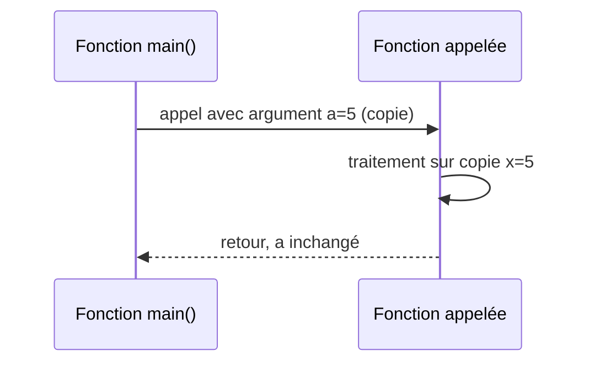

# Séance 4 : Fonctions et Modularité (4 heures)

## Partie 2 : Passage d'Arguments et Valeurs de Retour

### 1. Passage d'arguments par valeur (copie des données)

---

## 1. Principe du passage par valeur

En langage C, les arguments passés à une fonction le sont par **valeur** par défaut. Cela signifie que :

- Une **copie** de la valeur de l’argument est transmise à la fonction.
- La fonction travaille donc sur cette copie, sans modifier la variable d'origine dans la fonction appelante.
- Toute modification effectuée sur le paramètre dans la fonction n’a pas d’effet sur la variable passée.

---

## 2. Exemple simple

```c
#include <stdio.h>

// Fonction qui tente de modifier la valeur d'un entier reçu en paramètre
void incrementer(int x) {
    x = x + 1;
    printf("Dans la fonction : x = %d\n", x);
}

int main() {
    int a = 5;
    incrementer(a);
    printf("Après appel de la fonction : a = %d\n", a);
    return 0;
}
```

**Résultat :**

```
Dans la fonction : x = 6
Après appel de la fonction : a = 5
```

- `a` dans `main` reste inchangé car `x` est une copie locale.

---

## 3. Implications du passage par valeur

| Avantage                         | Inconvénient                          |
|---------------------------------|-------------------------------------|
| Sécurité : pas de modification accidentelle des variables externes | Pas possible de modifier directement les données de la fonction appelante |
| Simplicité de compréhension     | Pour modifier les données, nécessité de passer des pointeurs |

---

## 4. Illustration avec diagramme Mermaid



---

## 5. Résumé technique

- Le passage par valeur correspond à un **copiage bit à bit** des données.
- Applicable à tous les types simples (int, float, char, structures).
- Pour les structures volumineuses, le passage par valeur peut être coûteux en termes de mémoire/cycles CPU.
- En cas de données complexes ou besoin de modifier les variables d'appel, utiliser le passage par adresse (pointeurs).

---

## 6. Sources utilisées

- [GeeksforGeeks - Call by Value in C](https://www.geeksforgeeks.org/pass-by-value-in-c/)  
- [TutorialsPoint - C Pass By Value](https://www.tutorialspoint.com/cprogramming/c_pass_by_value.htm)  
- [cppreference.com - Function arguments](https://en.cppreference.com/w/c/language/functions)  
- ISO/IEC 9899:2018 (C18) – Passage des arguments

---

Le passage par valeur est la méthode standard en C pour transmettre des arguments aux fonctions. Comprendre ce mécanisme clarifie le comportement du programme face aux modifications des données et permet de choisir la méthode la plus adaptée selon le contexte.