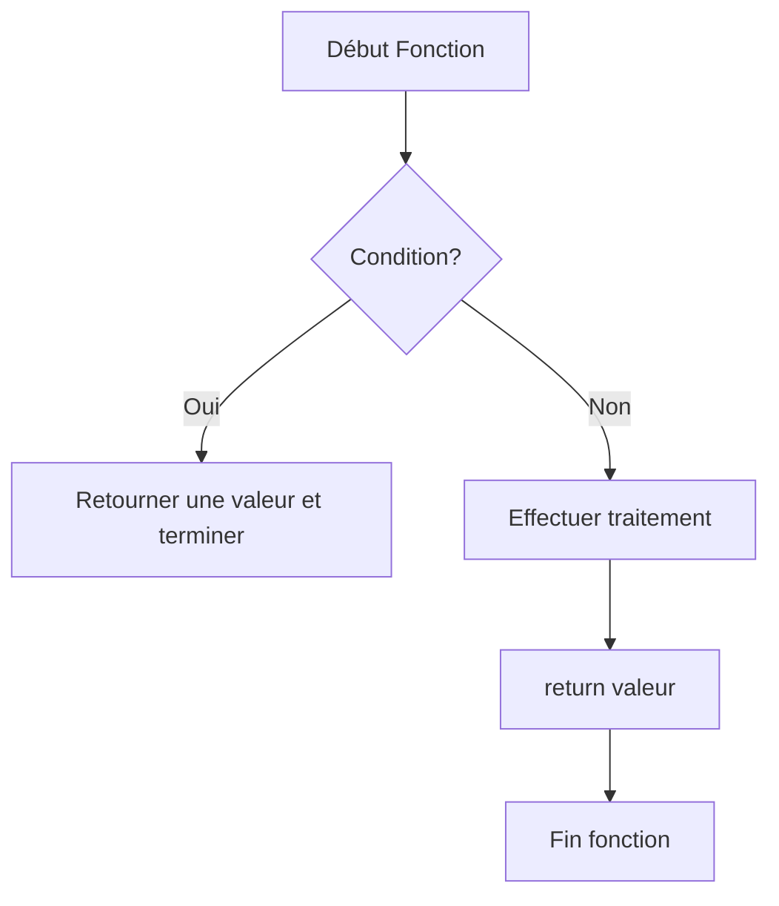

# Séance 4 : Fonctions et Modularité (4 heures)

## Partie 2 : Passage d'Arguments et Valeurs de Retour

### 2. L'instruction `return` et son rôle

---

## 1. Fonction de l'instruction `return`

L’instruction `return` dans une fonction en langage C remplit deux fonctions essentielles :

- **Terminer l’exécution** de la fonction immédiatement.
- **Retourner une valeur** (optionnelle) au point d'appel de la fonction.

---

## 2. Syntaxe générale

```c
return expression;
```

- `expression` est une valeur compatible avec le type de retour de la fonction.
- Dans une fonction ayant un type de retour `void`, l'instruction `return;` peut être utilisée pour sortir prématurément, sans valeur.

---

## 3. Exemple simple avec valeur de retour

```c
#include <stdio.h>

int carre(int n) {
    return n * n;
}

int main() {
    int x = 4;
    int result = carre(x);
    printf("Carré de %d = %d\n", x, result);
    return 0;
}
```

- La fonction `carre` retourne le résultat qui est assigné à `result` dans `main`.
- L’exécution quitte la fonction dès le `return`.

---

## 4. Exemple dans une fonction `void`

```c
#include <stdio.h>

void afficherMessage(int n) {
    if (n <= 0) {
        printf("Valeur non positive\n");
        return;  // sortie anticipée
    }
    printf("Valeur positive : %d\n", n);
}

int main() {
    afficherMessage(5);
    afficherMessage(-1);
    return 0;
}
```

- Le `return;` arrête l’exécution de la fonction `afficherMessage` si la condition est remplie.
- Pas de valeur retournée car la fonction est `void`.

---

## 5. Importance dans la gestion du flux

- Permet de **sortir immédiatement** d’une fonction, utile dans les tests conditionnels.
- Suit toujours la **valeur retournée** un chemin clair vers le programme appelant.
- Obligatoire dans toutes les fonctions sauf celles de type `void` si elles terminent naturellement.

---

## 6. Diagramme Mermaid : flux avec `return`



---

## 7. Synthèse

| Aspect                  | Description                                     |
|-------------------------|------------------------------------------------|
| Terminaison             | `return` termine la fonction immédiatement    |
| Valeur retournée        | Permet de renvoyer une donnée au programme appelant |
| Utilité dans `void`     | Utilisé pour sortie anticipée, sans valeur      |
| Obligatoire             | Doit correspondre au type de retour de la fonction |

---

## 8. Sources utilisées

- [cppreference.com - return statement](https://en.cppreference.com/w/c/language/return)  
- [TutorialsPoint - Return Statement in C](https://www.tutorialspoint.com/cprogramming/c_return_statement.htm)  
- [GeeksforGeeks - return statement in C](https://www.geeksforgeeks.org/return-statement-in-c/)  
- ISO/IEC 9899:2018 (C18) – Section 6.8.6.4

---

L’instruction `return` est l’instrument fondamental pour passer une valeur calculée et contrôler la fin d’une fonction. Son usage approprié rend les programmes plus clairs, efficaces et maitrisables.