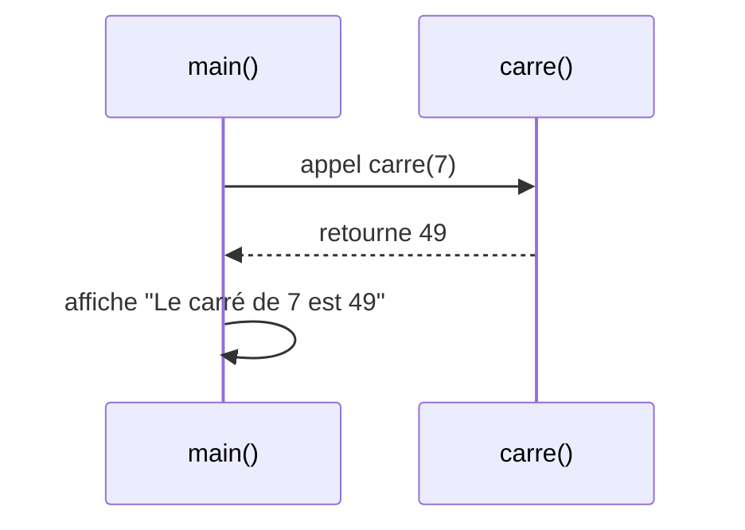

# Séance 4 : Fonctions et Modularité (4 heures)

## Partie 4 : Conception de Fonctions Simples

### 1. Exemples de fonctions pour effectuer des tâches spécifiques

---

## 1. Concepts clés

- Une fonction en C sert à encapsuler un ensemble d’instructions réalisant une tâche précise.
- Elle favorise la **réutilisation**, la **lisibilité** et la **modularité** du code.
- Les fonctions peuvent recevoir des **paramètres** et retourner une **valeur** selon leur rôle.

---

## 2. Exemple 1 : Calculer le carré d’un nombre

### 2.1 Objectif

Créer une fonction qui reçoit un nombre et retourne son carré.

### 2.2 Code

```c
#include <stdio.h>

// Fonction calculant le carré d'un entier
int carre(int n) {
    return n * n;
}

int main() {
    int x = 7;
    printf("Le carré de %d est %d\n", x, carre(x));
    return 0;
}
```

### 2.3 Explications

- `carre` prend un entier en paramètre.
- Elle retourne le produit de ce nombre par lui-même.
- Dans `main`, l’appel de `carre(x)` fournit le résultat qui est affiché.

---

## 3. Exemple 2 : Afficher un message personnalisé

### 3.1 Objectif

Créer une fonction qui affiche un message comprenant un nom passé en paramètre.

### 3.2 Code

```c
#include <stdio.h>

// Fonction affichant un message personnalisé
void afficherMessage(char nom[]) {
    printf("Bonjour, %s !\n", nom);
}

int main() {
    char nom[] = "Alice";
    afficherMessage(nom);
    return 0;
}
```

### 3.3 Explications

- `afficherMessage` reçoit une chaîne de caractères (tableau de `char`).
- Elle utilise `printf` pour afficher un message personnalisé.
- Fonction de type `void` : aucune valeur retournée, action uniquement sur la sortie.

---

## 4. Bonnes pratiques

- Donner des noms explicites aux fonctions.
- Privilégier une tâche simple par fonction.
- Utiliser le typage correct des paramètres et des valeurs de retour.
- Documenter chaque fonction avec un bref commentaire.

---

## 5. Diagramme Mermaid : appel d’une fonction simple



---

## 6. Sources utilisées

- [GeeksforGeeks - Functions in C](https://www.geeksforgeeks.org/functions-in-c/)  
- [TutorialsPoint - C Functions](https://www.tutorialspoint.com/cprogramming/c_functions.htm)  
- ISO/IEC 9899:2018 (C18) – Chapitre 6.7 Fonctions

---

Modulariser l’écriture en fonctions simples permet de mieux organiser le code, de faciliter la maintenance et de clarifier l’intention lors du développement. Ces exemples montrent la simplicité et l’utilité directe de ce concept fondamental en C.