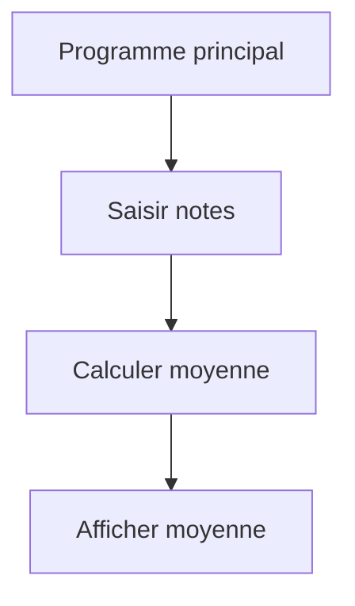

# Séance 4 : Fonctions et Modularité (4 heures)

## Partie 4 : Conception de Fonctions Simples

### 2. Décomposer un problème en sous-problèmes gérables par des fonctions

---

## 1. Pourquoi décomposer un problème ?

- Un programme complexe peut être difficile à comprendre, déboguer et maintenir.
- La **décomposition** en sous-problèmes simplifie le raisonnement.
- Désarticuler une tâche en fonctions spécifiques permet de tester, réutiliser et faire évoluer facilement chaque partie.

---

## 2. Principe de décomposition fonctionnelle

- Identifier les étapes indépendantes ou cohérentes d’un problème.
- Concevoir pour chaque étape une fonction avec un rôle bien défini.
- Interconnecter ces fonctions pour réaliser la solution globale.

---

## 3. Exemple concret : calcul de la moyenne de notes avec affichage

Supposons un programme qui doit :

1. Lire plusieurs notes.
2. Calculer la moyenne.
3. Afficher le résultat.

---

### 3.1 Étape 1 : Lecture des notes

```c
#include <stdio.h>

void saisirNotes(int notes[], int n) {
    for (int i = 0; i < n; i++) {
        printf("Note %d : ", i + 1);
        scanf("%d", &notes[i]);
    }
}
```

---

### 3.2 Étape 2 : Calcul de la moyenne

```c
double calculerMoyenne(int notes[], int n) {
    int somme = 0;
    for (int i = 0; i < n; i++) {
        somme += notes[i];
    }
    return (double)somme / n;
}
```

---

### 3.3 Étape 3 : Affichage

```c
void afficherMoyenne(double moyenne) {
    printf("La moyenne est : %.2f\n", moyenne);
}
```

---

### 3.4 Programme principal combinant les fonctions

```c
int main() {
    int n = 5;
    int notes[5];

    saisirNotes(notes, n);
    double moyenne = calculerMoyenne(notes, n);
    afficherMoyenne(moyenne);

    return 0;
}
```

---

## 4. Diagramme Mermaid : décomposition d’un problème en fonctions



- Chaque fonction traite un sous-problème.
- Le découpage arrive à une structure claire et modulaire.

---

## 5. Bonnes pratiques pour la décomposition

- **Une fonction = une tâche** : limitée à une responsabilité unique.
- Paramétrer les fonctions pour les rendre génériques et réutilisables.
- Limiter la taille et la complexité de chaque fonction.
- Documenter clairement l’interface (paramètres, résultats).

---

## 6. Sources utilisées

- [GeeksforGeeks - Modular Programming in C](https://www.geeksforgeeks.org/modular-programming-in-c/)  
- [TutorialsPoint - Modular Programming](https://www.tutorialspoint.com/cprogramming/c_modular_programming.htm)  
- ISO/IEC 9899:2018 (C18) – principe de modularité, chapitres 6.7 Fonctions

---

Décomposer un problème en fonctions gérables apporte clarté, facilite la conception, le test et la maintenance d’un logiciel. Ce principe s’applique dans tout développement sérieux et constitue la base d’une programmation modulaire efficace.